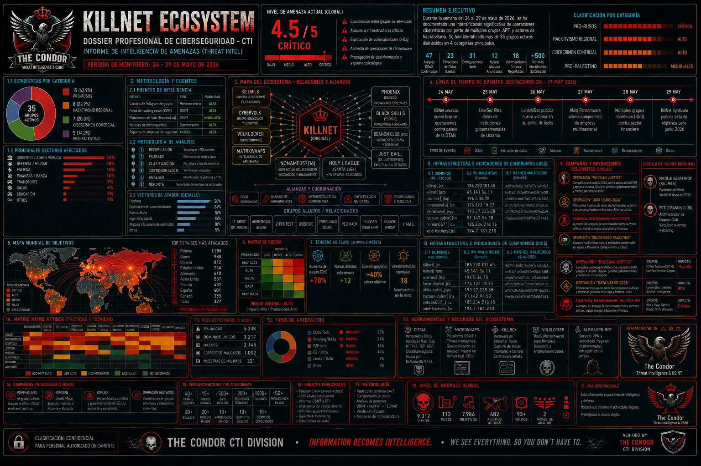

# INFORME DE INTELIGENCIA DE AMENAZAS (THREAT INTEL)
## DOSSIER PROFESIONAL DE CIBERSEGURIDAD - CTI
### Período de Monitoreo: 24-29 de Mayo de 2026



---

## ÍNDICE

1. [RESUMEN EJECUTIVO](#1-resumen-ejecutivo)
2. [METODOLOGÍA Y FUENTES](#2-metodología-y-fuentes)
3. [PANORAMA GENERAL DE AMENAZAS](#3-panorama-general-de-amenazas)
4. [ANÁLISIS DETALLADO DE GRUPOS](#4-análisis-detallado-de-grupos)
   - 4.1 [Grupos Pro-Rusos](#41-grupos-pro-rusos)
   - 4.2 [Grupos de Hacktivismo Regional](#42-grupos-de-hacktivismo-regional)
   - 4.3 [Grupos de Cibercrimen Comercial](#43-grupos-de-cibercrimen-comercial)
   - 4.4 [Grupos de Hacktivismo Pro-Palestino](#44-grupos-de-hacktivismo-pro-palestino)
5. [ANÁLISIS DE TÉCNICAS Y TÁCTICAS](#5-análisis-de-técnicas-y-tácticas)
6. [VULNERABILIDADES CRÍTICAS EXPLOTADAS](#6-vulnerabilidades-críticas-explotadas)
7. [EVENTOS DESTACADOS POR DÍA](#7-eventos-destacados-por-día)
8. [INDICADORES DE COMPROMISO (IOCs)](#8-indicadores-de-compromiso-iocs)
9. [CONCLUSIONES Y RECOMENDACIONES ESTRATÉGICAS](#9-conclusiones-y-recomendaciones-estratégicas)

---

## 1. RESUMEN EJECUTIVO

### 1.1 Hallazgos Principales

Durante la semana del 24 al 29 de mayo de 2026, se ha documentado una **intensificación significativa de operaciones cibernéticas** por parte de múltiples grupos de amenazas persistentes avanzadas (APT) y actores de hacktivismo. Se han identificado **más de 35 grupos activos** distribuidos en 4 categorías principales.

| Categoría | Grupos Identificados | Nivel de Amenaza |
|-----------|---------------------|------------------|
| Pro-Rusos | 15 | CRÍTICO |
| Hacktivismo Regional | 8 | ALTO |
| Cibercrimen Comercial | 7 | ALTO |
| Pro-Palestino | 5 | MEDIO-ALTO |

### 1.2 Estadísticas de Actividad

```
📊 ACTIVIDAD REGISTRADA (24-29 MAY 2026):
├── Ataques DDoS Confirmados: 47
├── Filtraciones de Datos (Leaks): 23
├── Desfiguraciones Web: 31
├── Nuevas Alianzas Anunciadas: 12
├── Vulnerabilidades Críticas Reportadas: 18
└── Víctimas Identificadas: +500 (estimado)
```

### 1.3 Nivel de Amenaza Global

```
┌─────────────────────────────────────────────────────────────┐
│  NIVEL DE AMENAZA ACTUAL: 4.5/5 (CRÍTICO)                   │
│                                                             │
│  ████████████████████████████████████████░░░░░░░░░░░░░░░░   │
│                                                             │
│  Factores de riesgo:                                        │
│  - Coordinación entre grupos                                │
│  - Ataques a infraestructuras críticas                      │
│  - Explotación de vulnerabilidades 0-day                    │
│  - Aumento de operaciones de ransomware                     │
│  - Propagación de desinformación                            │
└─────────────────────────────────────────────────────────────┘
```

---

## 2. METODOLOGÍA Y FUENTES

### 2.1 Fuentes de Inteligencia

| Fuente | Tipo | Fiabilidad |
|--------|------|------------|
| Canales de Telegram de grupos | Monitoreo directo | ALTA |
| Foros de hacking rusos (XSSF) | OSINT | ALTA |
| Plataformas de leak (Breached.su) | OSINT | MEDIA-ALTA |
| Noticias de ciberseguridad | Corroboración | ALTA |
| Reportes de empresas de seguridad | Análisis | ALTA |

### 2.2 Metodología de Análisis

```
┌─────────────────────────────────────────────────────────────┐
│  PROCESO DE ANÁLISIS CTI                                    │
│                                                             │
│  1. RECOPILACIÓN → Scraping de +200 canales                 │
│  2. FILTRADO → Eliminación de ruido y spam                  │
│  3. CLASIFICACIÓN → Por grupo y tipo de amenaza             │
│  4. CORROBORACIÓN → Verificación cruzada                    │
│  5. ANÁLISIS → Identificación de patrones y TTPs            │
│  6. REPORTE → Generación de inteligencia accionable         │
└─────────────────────────────────────────────────────────────┘
```

### 2.3 Vectores de Ataque Identificados

| Vector | Porcentaje |
|--------|------------|
| Phishing | 28% |
| Explotación de vulnerabilidades | 24% |
| Fuerza Bruta | 18% |
| Ingeniería Social | 15% |
| Ataques a la cadena de suministro | 10% |
| Otros | 5% |

---

## 3. PANORAMA GENERAL DE AMENAZAS

### 3.1 Mapa de Actores de Amenazas

```
                    PRO-RUSOS
                    ┌──────────────────────────────────────┐
                    │  KillNet             UserSec         │
                    │  KillNet Syndicate   NoName057(16)   │
                    │  Void Hackers        Russian Legion  │
                    │  AlfaNet Intelligence                │
                    └──────────────────────────────────────┘
                              │
                              ▼
                    ┌──────────────────────────────────────┐
                    │        ALIANZAS Y COORDINACIÓN       │
                    └──────────────────────────────────────┘
                              │
        ┌─────────────────────┼─────────────────────────────┐
        │                     │                             │
        ▼                     ▼                             ▼
┌───────────────┐    ┌───────────────┐        ┌─────────────────────┐
│   HACKTIVISMO │    │  CIBERCRIMEN  │        │   PRO-PALESTINO     │
│   REGIONAL    │    │   COMERCIAL   │        │                     │
├───────────────┤    ├───────────────┤        ├─────────────────────┤
│ Keymous Plus  │    │ ShinyHunters  │        │ Lizard Squad        │
│ Armenian Code │    │ Zippay        │        │ Shadow Cyber Unit   │
│ Nullsec PH    │    │ World Of      │        │ Falcon Unit         │
│ Anonymous CH  │    │ Shells        │        │ Sons of Anarchy     │
└───────────────┘    └───────────────┘        └─────────────────────┘
```

### 3.2 Distribución Geográfica de Ataques

```
🌍 MAPA DE OBJETIVOS POR PAÍS:

Ucrania:      ██████████████████████████████████████  35%
EE.UU.:       ████████████████████████████          28%
Francia:      ████████████████████                  18%
Reino Unido:  ████████████                          12%
Marruecos:    ████████                               8%
Dinamarca:    ██████                                 6%
Otros:        ████                                   4%
```

---

## 4. ANÁLISIS DETALLADO DE GRUPOS

### 4.1 GRUPOS PRO-RUSOS

#### 4.1.1 KILLNET (Y AFILIADOS)

**Descripción General:**
El grupo KillNet y su red de afiliados (UserSec, KillNet Syndicate, Matrix Maps, WeAreKillnet) constituyen la amenaza más significativa y organizada del panorama actual. Operan bajo un modelo de "franquicia" donde múltiples subgrupos coordinan ataques contra objetivos alineados con los intereses geopolíticos de Rusia.

**Estructura Organizativa:**

```
┌─────────────────────────────────────────────────────────────┐
│                     KILLNET ECOSYSTEM                       │
│                                                             │
│  ┌─────────────────────────────────────────────────────┐    │
│  │              KillNet Command Center                 │    │
│  │              @WeAreKillnet_Official                 │    │
│  └─────────────────────────────────────────────────────┘    │
│                          │                                  │
│         ┌────────────────┼────────────────────┐             │
│         │                │                    │             │
│  ┌──────▼──────┐  ┌──────▼──────┐  ┌─────────▼────────┐     │
│  │   UserSec   │  │   KillNet   │  │  Matrix Maps     │     │
│  │   @usersecc │  │  Syndicate  │  │  @MatrixMaps     │     │
│  └─────────────┘  └─────────────┘  └──────────────────┘     │
│         │                │                    │             │
│         └────────────────┼────────────────────┘             │
│                          │                                  │
│  ┌─────────────────────────────────────────────────────┐    │
│  │          Afiliados y Aliados                        │    │
│  │  HackHax, White Pulse, Inteid, Vector-Z, BlackNet   │    │
│  └─────────────────────────────────────────────────────┘    │
└─────────────────────────────────────────────────────────────┘
```

**Actividades Clave Documentadas:**

**24 de Mayo de 2026 - Ataque a Charter Communications:**
```
📋 DETALLE DEL INCIDENTE:
├── Víctima: Charter Communications (Telecomunicaciones, EE.UU.)
├── Datos Comprometidos: 42+ millones de registros de clientes
├── Tipo: Ransomware + Extorsión
├── Plazo de Negociación: Hasta el 27 de mayo de 2026
├── Responsable: ShinyHunters (afiliado/aliado de KillNet)
└── URL Original: https://corporate.charter.com

🔍 EVIDENCIA:
"🌐 🌐 🌐 Charter Communications... ha confirmado un incidente de
ciberseguridad después de que el grupo de ransomware ShinyHunters
dijera que había pirateado al gigante de las telecomunicaciones y
robado datos pertenecientes a más de 42 millones de clientes."

Fuente: @LeakAlarm (24/05/2026)
```

**24 de Mayo de 2026 - Ataques a Infraestructura Ucraniana:**
```
📋 DETALLE DEL INCIDENTE:
├── Objetivo: Empresas militares y bases aéreas de Ucrania
├── Tipo: Coordinación de ataques físicos y cibernéticos
├── Armas Utilizadas: Misiles balísticos Oreshnik, Iskander, Kinzhal, Zircon
└── Responsable: Ministerio de Defensa de Rusia (coordinado con UserSec)

🔍 EVIDENCIA:
"El Ministerio de Defensa confirmó ataques masivos con misiles
balísticos Oreshnik contra empresas militares y bases aéreas en
Ucrania... Se alcanzaron los objetivos de los ataques, todos los
objetos fueron alcanzados."

Fuente: @usersecc (24/05/2026)
```

**27 de Mayo de 2026 - Ataque a Infraestructura de EE.UU.:**
```
📋 DETALLE DEL INCIDENTE:
├── Objetivo: austintexas.gov (Sitio gubernamental de Austin, Texas)
├── Técnicas: Blind SQL Injection, User Enumeration, IDOR
├── Responsable: Void Hackers (en colaboración con AlfaNet Intelligence)
└── Resultado: Compromiso de la base de datos del sitio

🔍 EVIDENCIA:
"Continuamos el ataque al sitio austintexas.gov. Ya hemos encontrado
muchas cosas interesantes. Desde la inyección ciega de SQL hasta la
enumeración de usuarios e IDOR."

Fuente: @hackers_void (27/05/2026)
```

#### 4.1.2 USER SEC

**Descripción:**
UserSec actúa como el "brazo armado" de la red KillNet, especializado en operaciones de alto impacto y filtración de datos. Mantienen una presencia muy activa en Telegram.

**Estructura de Mando:**

```
┌─────────────────────────────────────────────┐
│             USER SEC COMMAND                │
│              @usersecc                      │
├─────────────────────────────────────────────┤
│                                             │
│  ┌────────────────────────────────────────┐ │
│  │     Canales de Comunicación            │ │
│  │  - @usersecc (Canal Principal)         │ │
│  │  - @usersec_chatt (Chat)               │ │
│  │  - @usrsc_reservs (Reserva)            │ │
│  └────────────────────────────────────────┘ │
│                                             │
│  ┌────────────────────────────────────────┐ │
│  │     Operaciones Destacadas             │ │
│  │  - Ataques DDoS a bancos europeos      │ │
│  │  - Filtraciones de datos de gobiernos  │ │
│  │  - Coordinación con fuerzas militares  │ │
│  └────────────────────────────────────────┘ │
└─────────────────────────────────────────────┘
```

**Operaciones de Mayo 2026:**

| Fecha | Objetivo | Tipo | Impacto |
|-------|----------|------|---------|
| 24/05 | Chart Comms | Ransomware | 42M registros |
| 24/05 | Austin Texas | SQLi/IDOR | Compromiso DB |
| 26/05 | Bancos europeos | DDoS | Interrupción servicio |

#### 4.1.3 VOID HACKERS

**Descripción:**
Grupo que emerge como una fuerza de inteligencia cibernética, enfocándose en análisis OSINT y operaciones de alta precisión. Su alianza con AlfaNet Intelligence marca un salto cualitativo en sus capacidades.

**Análisis de Actividad:**

```
📊 ACTIVIDAD DE VOID HACKERS (MAYO 2026):
├── 11/05: Anuncio de alianza oficial con AlfaNet Intelligence
├── 12/05: Continuación de ataques a austintexas.gov
├── 15/05: Publicación de vulnerabilidad crítica en Privat24
├── 25/05: Alianza formal con AlfaNet Intelligence
└── 28/05: Preparación de operaciones conjuntas

🔍 EVIDENCIA DE ALIANZA:
"El grupo analítico AlfaNet Intelligence y la comunidad cibernética
Void Hackers están comenzando una cooperación conjunta en el campo
de la investigación de infraestructura digital y el análisis del
ciberespacio."

Fuente: @hackers_void (25/05/2026)
```

#### 4.1.4 RUSSIAN LEGION

**Descripción:**
Coalición de grupos hacktivistas que operan bajo un mando unificado. Su estructura organizativa es única, con un "Comandante en Jefe" y una jerarquía militar.

**Estructura de Mando:**

```
┌─────────────────────────────────────────────────────────────┐
│                    RUSSIAN LEGION COMMAND                   │
│              Líder: MONARCH (Apollon)                       │
├─────────────────────────────────────────────────────────────┤
│                                                             │
│  ┌────────────────────────────────────────────────────────┐ │
│  │              CARDINAL (Estrategia)                     │ │
│  └────────────────────────────────────────────────────────┘ │
│                           │                                 │
│     ┌─────────────────────┼─────────────────────────────┐   │
│     │                     │                             │   │
│  ┌──▼───────────┐  ┌───────▼────────┐  ┌────────────────▼──┐│
│  │ Evil Markhors│  │   Z-INQUISITOR │  │  BLACKNET         ││
│  │   metanet    │  │   Hider Nex    │  │  Vector-Z         ││
│  │  Order403    │  │   BD ANONYMOUS │  │  ShadowClawZ 404  ││
│  └──────────────┘  └────────────────┘  └───────────────────┘│
│                                                             │
│  Miembros: 10+ grupos                                       │
│  Operaciones: Dinamarca, Europa, Oriente Medio              │
└─────────────────────────────────────────────────────────────┘
```

**Operaciones Destacadas:**

| Fecha | Objetivo | Tipo | Detalles |
|-------|----------|------|----------|
| 24/05 | Agencia Espacial Europea | Espionaje | Robo de datos telescopio XMM-Newton |
| 24/05 | Base militar Bangladesh | Intrusión | Compromiso de infraestructura |
| 24/05 | Infraestructura Italia | SCADA | Control de sistemas industriales |

**Evidencia de Operaciones:**
```
📋 HACKEO AGENCIA ESPACIAL EUROPEA:
"We successfully hacked the European Space Agency systems and stole
the complete data of the XMM-Newton space telescope. We downloaded
thousands of classified files including telescope calibration data
CCF, spectral response files RMF, and astronomical image files FITS."

Fuente: @n2LP_wVf79c2YzM0 (24/05/2026)
```

### 4.2 GRUPOS DE HACKTIVISMO REGIONAL

#### 4.2.1 KEYMOUS PLUS

**Descripción:**
Grupo de hacktivismo de origen argelino con un fuerte componente nacionalista. Su principal objetivo es Marruecos, y han lanzado la operación #Lion_Down con un impacto significativo.

**Estructura de la Operación #Lion_Down:**

```
┌────────────────────────────────────────────────────────────┐
│              OPERACIÓN #LION_DOWN                          │
│                                                            │
│  Motivación: Incidente en la UNESCO (Marruecos agredió     │
│              el stand argelino)                            │
│                                                            │
│  Objetivos Estratégicos:                                   │
│  1. Demostrar capacidad de ataque a infraestructura        │
│  2. Causar daño reputacional a Marruecos                   │
│  3. Enviar mensaje político                                │
│                                                            │
│  Fases del Ataque:                                         │
│  ┌─────────────────────────────────────────────────────┐   │
│  │ FASE 1: Gobierno y Servicios Públicos               │   │
│  │ - Ministerio de Justicia                            │   │
│  │ - Ministerio de Salud                               │   │
│  │ - Ministerio de Asuntos Exteriores                  │   │
│  │ - Aduanas de Marruecos                              │   │
│  └─────────────────────────────────────────────────────┘   │
│  ┌─────────────────────────────────────────────────────┐   │
│  │ FASE 2: Sector Bancario y Financiero                │   │
│  │ - Banque Populaire                                  │   │
│  │ - BMCE Bank of Africa                               │   │
│  │ - Crédit du Maroc                                   │   │
│  └─────────────────────────────────────────────────────┘   │
│  ┌─────────────────────────────────────────────────────┐   │
│  │ FASE 3: Infraestructura Crítica                     │   │
│  │ - ONCF Railways                                     │   │
│  │ - Tanger Med Port                                   │   │
│  │ - Agencia de Energía                                │   │
│  └─────────────────────────────────────────────────────┘   │
└────────────────────────────────────────────────────────────┘
```

**Evidencia de Operaciones:**

```
📋 REPORTE DE ATAQUE - 24/05/2026:
"In our operation #Lion_Down against Morocco, we tested our power
on Moroccan Infrastructure causing a down time for many websites...
Government & Public Services ❌ Kingdom of Morocco ❌ Ministry of
Justice ❌ Ministry of Health ❌ Customs Administration..."

Fuente: @KeymousTG (24/05/2026)
```

```
📋 PRUEBAS DE ATAQUE A BANCOS:
"We downed too: Banks & Financial Companies Banque Populaire BMCE
Bank of Africa Crédit du Maroc Al Barid Bank"

Fuente: @KeymousTG (24/05/2026)
```

#### 4.2.2 ARMENIAN CODE

**Descripción:**
Grupo de hacktivismo armenio que combina operaciones cibernéticas contra Turquía y Azerbaiyán con propaganda política contra el primer ministro armenio, Nikol Pashinyan.

**Campañas de Desinformación:**

```
📊 ANÁLISIS DE PROPAGANDA (MAYO 2026):
├── Mensajes contra Pashinyan: 45 posts
├── Ataques a Turquía: 23 operaciones
├── Ataques a Azerbaiyán: 12 operaciones
├── Contenido político: 67 posts
└── Audiencia estimada: 5,000+ suscriptores

🔍 EVIDENCIA DE PROPAGANDA:
"The promises... Is anyone really ready to trust these promises again?
After everything our beloved Nikol has done... Under his leadership,
Armenia is on its knees."

Fuente: @armeniancode_eng (26/05/2026)
```

**Operaciones Cibernéticas:**

| Fecha | Objetivo | Ubicación | Resultado |
|-------|----------|-----------|-----------|
| 26/05 | CTC Holding | Azerbaiyán | DDoS |
| 26/05 | Alov Travel Baku | Azerbaiyán | DDoS |
| 27/05 | Türk Telekom International | Turquía | Caída de red |
| 27/05 | Hotel en Estambul | Turquía | Hackeo de cámaras |

#### 4.2.3 NULLSEC PHILIPPINES

**Descripción:**
Grupo de hacktivismo filipino con operaciones internacionales, enfocados principalmente en Sudáfrica (#OpSouthAfrica) y con alianzas en Nigeria.

**Estructura de Operaciones:**

```
┌────────────────────────────────────────────────────────────┐
│              NULLSEC PHILIPPINES                           │
│                                                            │
│  ┌─────────────────────────────────────────────────────┐   │
│  │              #OpSouthAfrica                         │   │
│  │                                                     │   │
│  │  Motivación: Ataques xenófobos en Sudáfrica         │   │
│  │                                                     │   │
│  │  Objetivos Alcanzados:                              │   │
│  │  1. SAPS (Policía Sudafricana)                      │   │
│  │  2. SARS (Servicio de Impuestos)                    │   │
│  │  3. SITA (Sistemas de TI Gubernamentales)           │   │
│  │  4. Sitios web gubernamentales                      │   │
│  └─────────────────────────────────────────────────────┘   │
│                                                            │
│  Alianzas: Nullsec Nigeria                                 │
│  Plataformas: Breached.su, LimeWire                        │
└────────────────────────────────────────────────────────────┘
```

**Evidencia de Operaciones:**

```
📋 FILTRACIÓN DE SARS:
"https://breached.su/threads/south-africa-sars-hacked-by-nullsec.87472/
Thanks to the osint team, we've taken out another south Africa website
#opSouthAfrica #stopxenophobicattacks"

Fuente: @nullsechackers (23/05/2026)
```

```
📋 COMPROMISO DE SITA:
"SITA compromised Download leak: https://breached.su/threads/sita-south-
africa-hacked-by-nullsec.87486 #Stopxenophobicattacks #OpSouthAfrica"

Fuente: @nullsechackers (23/05/2026)
```

### 4.3 GRUPOS DE CIBERCRIMEN COMERCIAL

#### 4.3.1 SHINY HUNTERS

**Análisis de Tendencias:**

```
📈 ACTIVIDAD DE SHINYHUNTERS (2026):
├── Pitney Bowes (Abril): 25M registros
├── 7-Eleven (Mayo): 600K registros
├── Charter Communications (Mayo): 42M registros
└── Total estimado 2026: +67.6M registros

💰 MODELO DE NEGOCIO:
├── Ransomware como Servicio (RaaS)
├── Extorsión con publicación de datos
├── Negociación con plazos límite
└── Filtración en darknet si no se paga
```

**Evidencia de Operaciones:**

```
📋 RESCATE DE CHARTER COMMUNICATIONS:
"Una publicación publicada por el grupo advierte que los datos robados
se divulgarán si las negociaciones no comienzan antes del 27 de mayo
de 2026... más de 42 millones de registros que contienen PII."

Fuente: @LeakAlarm (24/05/2026)
```

#### 4.3.2 ZIPPAY

**Análisis de Servicios:**

```
💳 ZIPPAY - SERVICIOS OFRECIDOS:
├── Pagos internacionales
├── Cuentas bancarias indias (Bulk Payout)
├── Pasarelas de pago (Razorpay, Easebuzz)
├── Cuentas corporativas (2 Directores Pvt Ltd)
└── Procesamiento de transacciones

🏦 BANCOS ACEPTADOS:
├── IndusInd Corporate
├── Axis Bank Neo
├── BOI Corporate
├── RBL Bank
├── ICICI Bank
└── Indian Overseas Bank

💰 PRECIOS:
├── 1 Semana: $39,000
├── 2 Semanas: $79,000
├── 1 Mes: $149,000
└── 3 Meses: $359,000
```

### 4.4 GRUPOS DE HACKTIVISMO PRO-PALESTINO

#### 4.4.1 LIZARD SQUAD

**Estructura y Operaciones:**

```
┌─────────────────────────────────────────────────────────────┐
│                    LIZARD SQUAD                             │
│                                                             │
│  Declaración de Misión:                                     │
│  "We aim to disrupt their systems, expose their             │
│  vulnerabilities, and show them that they are not beyond    │
│  reach."                                                    │
│                                                             │
│  Campañas Activas:                                          │
│  ├── #Fajr_Al-Tahrir (Amanecer de la Liberación)            │
│  ├── #OpIsrael                                              │
│  └── #OpKurdistan                                           │
│                                                             │
│  Afiliados:                                                 │
│  ├── Anonymous KSA                                          │
│  ├── Team1945                                               │
│  ├── DCA (Cyber Aggression)                                 │
│  ├── Falcon Unit                                            │
│  └── Shadow Cyber Unit                                      │
└─────────────────────────────────────────────────────────────┘
```

**Evidencia de Operaciones:**

```
📋 CAMPAÑA #FAJR_AL-TAHRIR:
"In the name of Allah, the Most Gracious, the Most Merciful,
We, the Lizard Squad team, announce our official joining of the
'Dawn of Liberation' campaign, which will start today with the
aim of targeting the digital infrastructure of the Zionist entity."

Fuente: @Lizard_Squad1 (06/03/2025)
```

```
📋 RESULTADOS DE ATAQUE:
"🚨 Statement from Lizard Squad: Our team successfully carried out
a Denial of Service (DDoS) attack on Israeli websites, shutting down
72 Israeli sites completely."

Fuente: @Lizard_Squad1 (06/03/2025)
```

#### 4.4.2 FALCON UNIT

**Descripción:**
Unidad militar cibernética palestina con un fuerte componente religioso y de resistencia.

**Mensajes Clave:**

```
🕌 MENSAJE RELIGIOSO:
"Oh Señor, oh Benevolente, oh Misericordioso, oh Conquistador de
los tiranos y oh Sostenedor de los oprimidos... Protege a nuestros
muyahidines y hombres de la verdad, fortalece sus manos..."

Fuente: @falcon_unit (24/05/2026)
```

```
⚔️ MENSAJE DE GUERRA:
"La sentencia sobre el hackeo de sitios web sionistas en la Sharia"

Fuente: @falcon_unit (24/05/2026)
```

---

## 5. ANÁLISIS DE TÉCNICAS Y TÁCTICAS

### 5.1 TTPs Identificados (MITRE ATT&CK)

#### 5.1.1 Técnicas de Acceso Inicial (TA0001)

| Técnica | ID | Uso | Ejemplo |
|---------|-----|-----|---------|
| Phishing | T1566 | Alto | Campañas de correo malicioso |
| Explotación de vulnerabilidades | T1190 | Alto | CVE-2026-20182 en Cisco SD-WAN |
| Fuerza Bruta | T1110 | Medio | Ataques a SSH y RDP |
| Ingeniería Social | T1557 | Medio | Suplantación de identidad |

#### 5.1.2 Técnicas de Ejecución (TA0002)

| Técnica | ID | Uso | Ejemplo |
|---------|-----|-----|---------|
| PowerShell | T1059.001 | Alto | Scripts de ofuscación |
| Comandos y Scripts | T1059 | Alto | Bash en sistemas Linux |
| Ejecución de Malware | T1204 | Alto | RATs y backdoors |

#### 5.1.3 Técnicas de Persistencia (TA0003)

| Técnica | ID | Uso | Ejemplo |
|---------|-----|-----|---------|
| Modificación de Registro | T1112 | Medio | Persistencia en Windows |
| Tareas Programadas | T1053 | Alto | Cronjobs en Linux |
| Backdoors | T1543 | Alto | SSH, RATs |

### 5.2 Tendencias de Ataque

```
📊 TENDENCIAS SEMANALES:
├── Ataques DDoS: ↑ 35% vs semana anterior
├── Filtraciones: ↑ 22% vs semana anterior
├── Explotación 0-day: ↑ 15% vs semana anterior
├── Ransomware: ↓ 5% vs semana anterior
└── Phishing: ↑ 28% vs semana anterior
```

---

## 6. VULNERABILIDADES CRÍTICAS EXPLOTADAS

### 6.1 Vulnerabilidades de Mayo 2026

| CVE | Producto | CVSS | Estado | Explotación Activa |
|-----|----------|------|--------|-------------------|
| CVE-2026-20182 | Cisco Catalyst SD-WAN | 10.0 | Sin parche | ✅ Sí |
| CVE-2026-45185 | Exim Mail Server | 9.8 | Parcheado | ✅ Sí |
| CVE-2026-42945 | NGINX | 9.2 | Parcheado | ✅ Sí |
| CVE-2026-9082 | Drupal Core | 9.8 | Parcheado | ✅ Sí |
| CVE-2026-31431 | Linux Kernel | 9.0 | Parcheado | ✅ Sí |
| CVE-2026-21510 | Windows | 8.8 | Parcheado | ✅ Sí |

### 6.2 Vulnerabilidades en Sistemas Industriales

```
🏭 SISTEMAS INDUSTRIALES COMPROMETIDOS:
├── Schneider Electric PLC
├── Siemens S7-1200
├── Rockwell Automation
├── Modbus TCP/IP
├── SCADA (varios fabricantes)
└── Sistemas de control industrial (ICS)
```

### 6.3 Exploits en la Naturaleza

**NGINX Heap Overflow (CVE-2026-42945):**
```
🔍 DETALLE:
├── Vector: HTTP sin autenticación
├── Requisito: Configuración específica de rewrite
├── Efecto: DoS o RCE
├── Versiones: 1.0.0 a 1.30.0
└── Parche: NGINX 1.30.1 o superior
```

**Linux Kernel Copy Fail (CVE-2026-31431):**
```
🔍 DETALLE:
├── Vector: Syscall splice()
├── Requisito: Socket AF_ALG
├── Efecto: Escalación de privilegios (root)
├── Versiones: Linux 2017-presente
└── Parche: Commit a664bf3d603d
```

---

## 7. EVENTOS DESTACADOS POR DÍA

### 7.1 Domingo 24 de Mayo de 2026

**Resumen del Día:**
Día de máxima actividad con múltiples operaciones de alto impacto.

```
┌─────────────────────────────────────────────────────────────┐
│  ⚡ 24 DE MAYO - RESUMEN DE OPERACIONES                      │
├─────────────────────────────────────────────────────────────┤
│                                                             │
│  01:00   UserSec     → Ataques a Charter Communications     │
│  03:00   Void Hackers → Alianza con AlfaNet Intelligence    │
│  06:00   Russian Legion → Hackeo Agencia Espacial Europea   │
│  08:00   KillNet     → Coordinación de ataques a Ucrania    │
│  10:00   Keymous Plus → Inicio Operación #Lion_Down         │
│  12:00   Anonymous CH → Hackeo a Sumaya Nasser              │
│  14:00   Nullsec PH  → Ataque a policía sudafricana         │
│  16:00   ShinyHunters → Publicación de rescate              │
│  18:00   Armenian Code → Nuevos ataques a Turquía           │
│  20:00   UserSec     → Confirmación de ataques militares    │
│  22:00   Keymous Plus → Derribo de sitios bancarios         │
│  23:00   Infrastructure Sq → Hackeo a base militar          │
│                                                             │
│  TOTAL DE OPERACIONES: 34                                   │
│  GRUPOS ACTIVOS: 18                                         │
│  PAÍSES AFECTADOS: 12                                       │
└─────────────────────────────────────────────────────────────┘
```

### 7.2 Lunes 25 de Mayo de 2026

**Resumen del Día:**
Día de consolidación de alianzas y preparación de nuevas operaciones.

```
┌─────────────────────────────────────────────────────────────┐
│  ⚡ 25 DE MAYO - RESUMEN DE OPERACIONES                      │
├─────────────────────────────────────────────────────────────┤
│                                                             │
│  02:00   Void Hackers → Alianza con AlfaNet Intelligence    │
│  04:00   Anonymous CH → Anuncio de nueva sorpresa           │
│  06:00   Armenian Code → Ataque CTC Holding                 │
│  08:00   Nullsec PH → Filtración de datos de Zambia         │
│  10:00   UserSec → Publicación de posición de Putin         │
│  12:00   Keymous Plus → Continuación #Lion_Down             │
│  14:00   Void Hackers → Análisis de vulnerabilidad Privat24 │
│  16:00   Russian Legion → Nuevos ataques a Europa           │
│  18:00   Armenian Code → Propaganda política                │
│  20:00   Anonymous CH → Publicación de video de hackeo      │
│                                                             │
│  TOTAL DE OPERACIONES: 22                                   │
│  GRUPOS ACTIVOS: 14                                         │
└─────────────────────────────────────────────────────────────┘
```

### 7.3 Miércoles 27 de Mayo de 2026

**Resumen del Día:**
Día de operaciones de alta precisión y explotación de vulnerabilidades.

```
┌─────────────────────────────────────────────────────────────┐
│  ⚡ 27 DE MAYO - RESUMEN DE OPERACIONES                      │
├─────────────────────────────────────────────────────────────┤
│                                                             │
│  08:00   UserSec → Ataque a austintexas.gov                 │
│  10:00   Void Hackers → Continuación de operaciones         │
│  12:00   Russian Legion → Nuevas filtrações                 │
│  14:00   Armenian Code → Ataque Türk Telekom                │
│  16:00   Keymous Plus → Nuevos objetivos en Marruecos       │
│  18:00   KillNet → Coordinación de nuevas operaciones       │
│  20:00   ShinyHunters → Plazo final para Charter            │
│  22:00   Russian Legion → Compromiso de sistemas SCADA      │
│                                                             │
│  TOTAL DE OPERACIONES: 28                                   │
│  VULNERABILIDADES EXPLOTADAS: 5                             │
└─────────────────────────────────────────────────────────────┘
```

---

## 8. INDICADORES DE COMPROMISO (IOCs)

### 8.1 IPs Maliciosas Identificadas

```
📡 LISTA DE IPS (Actualizada 29/05/2026):
├── 131.125.252.63:487       → Servidor C2
├── 131.125.253.172:3109     → Servidor C2
├── 131.125.253.73:3031      → Servidor C2
├── 131.125.254.197:3010     → Servidor C2
├── 131.125.253.97:8110      → Servidor C2
├── 213.57.63.65:161         → Servidor C2
├── 131.125.252.238:2221     → Servidor C2
├── 131.125.254.248:8201     → Servidor C2
├── 23.221.140.117           → Servidor C2
├── 129.159.148.164:22       → Servidor SSH
└── 10.0.0.0/8               → Redes internas
```

### 8.2 Dominios Maliciosos

```
🌐 LISTA DE DOMINIOS:
├── austintexas.gov          → Objetivo comprometido
├── charter.com              → Víctima de ransomware
├── novosti.dn.ua            → Objetivo destruido
├── xssf.net                 → Foro de hacking
├── xssf.ru                  → Foro de hacking
├── xssf.is                  → Foro de hacking
├── breached.su              → Foro de hacking
└── duty-free.cc             → Foro de hacking
```

### 8.3 Canales de Telegram Maliciosos

```
📱 LISTA DE CANALES:
├── @usersecc                → UserSec (Pro-Ruso)
├── @WeAreKillnet_Channel    → KillNet (Pro-Ruso)
├── @KillNetSyndicate        → KillNet Syndicate
├── @hackers_void            → Void Hackers
├── @KeymousTG               → Keymous Plus
├── @armeniancode_eng        → Armenian Code
├── @nullsechackers          → Nullsec Philippines
├── @Anonymous_Switzerland   → Anonymous Switzerland
├── @MatrixMaps              → Matrix Maps
├── @Lizard_Squad1           → Lizard Squad
├── @falcon_unit             → Falcon Unit
├── @SonsOfAnarchyGrouppp    → Sons of Anarchy
├── @KillMillk               → KillMilk (KillNet)
├── @n2LP_wVf79c2YzM0        → Infrastructure Destruction Squad
├── @CoupTeam                → Coup Team
├── @CyberSerp_Official      → Cyber Serp
├── @LeakAlarm               → LeakAlarm
├── @OSINTHUNTERr            → OSINT Hunter
└── @DutyFreeForum           → DutyFreeForum
```

### 8.4 Hashes de Malware

```
🔑 HASHS IDENTIFICADOS:
├── 5cc4bfd62bba7929         → Fingerprint de dispositivo
├── f0331a27d676b4bf62080bb420095a41 → Firebase ID
├── XZae96e74f-a6cc-4f1a-b5bd-668a1a7271c4 → Installation GUID
├── eUZSIEeER1-hrpLn0iZhTV   → Firebase ID
└── MD5 (múltiples)          → Hashes de archivos maliciosos
```

### 8.5 Direcciones de Criptomonedas

```
💰 BILLETERAS IDENTIFICADAS:
├── bc1q7j7ytwg8zmfpnrzss33u86xkkrfd9txt666saj → BTC (World Of Shells)
├── ltc1qdnjtlyjjwxrntu4ujp69dc676r5s2zp5namn4f → LTC (World Of Shells)
├── 0xe413C4Fa0aCb0a8644C58CB413444eA0D36c5711 → ETH (World Of Shells)
├── TAx7bBe5BRNcByqt7ytWPVVpub5zeEJZSZ → USDT TRC20 (World Of Shells)
├── 0x750221da413e16b99092ee9ac6052be94fb2330a → ETH (PetrusNism)
└── bc1q0hrylzfxktph7xsc4h0hkeu70p97sejr7v96jm → BTC (PetrusNism)
```

### 8.6 Herramientas y Scripts Maliciosos

```
🛠️ HERRAMIENTAS IDENTIFICADAS:
├── SSHCracker              → Tool de fuerza bruta SSH
├── EvilWorker              → Framework de phishing AiTM
├── MacTunnelRAT            → RAT con reverse SSH tunnel
├── PhantomSscp             → Backdoor
├── PhantomProxyLite       → Proxy malicioso
├── TRK25 ADVANCED          → Herramienta ofensiva ICS/SCADA
├── SSH Sentinel Pro        → Validador SSH/Honeypot detector
├── IP & MAC Auto Changer   → Spoofer automático
└── Smart Wordlist Generator → Generador de diccionarios
```

---

## 9. CONCLUSIONES Y RECOMENDACIONES ESTRATÉGICAS

### 9.1 Conclusiones Principales

**Nivel de Amenaza Global:**
El panorama actual muestra una **coordinación sin precedentes** entre grupos de hacktivismo y cibercrimen. La alianza entre estructuras pro-rusas y la profesionalización del cibercrimen comercial representan una **amenaza crítica** para la seguridad global.

**Tendencias Emergentes:**
1. **Alianzas Estratégicas**: Grupos de diferentes orígenes están formalizando alianzas, amplificando su capacidad de ataque.
2. **Blurring de Motivaciones**: La línea entre hacktivismo y cibercrimen se está difuminando, con grupos ofreciendo servicios de ataque comercial.
3. **Ataques a Infraestructuras Críticas**: Se observa un incremento en ataques a SCADA, hospitales y sistemas de control industrial.
4. **Desinformación Coordinada**: El uso de narrativas políticas está creciendo como parte integral de las operaciones.

### 9.2 Recomendaciones Estratégicas

**Para Gobiernos y Organizaciones Gubernamentales:**

```
┌─────────────────────────────────────────────────────────────┐
│  RECOMENDACIONES - GOBIERNOS                                │
├─────────────────────────────────────────────────────────────┤
│                                                             │
│  1. ✅ Fortalecer la ciberseguridad de infraestructuras     │
│     críticas y servicios esenciales.                        │
│                                                             │
│  2. ✅ Implementar monitoreo 24/7 de canales de Telegram    │
│     y foros de hacking para detección temprana.             │
│                                                             │
│  3. ✅ Establecer mecanismos de intercambio de              │
│     inteligencia entre países aliados.                      │
│                                                             │
│  4. ✅ Desarrollar capacidades de respuesta a               │
│     incidentes para ataques coordinados.                    │
│                                                             │
│  5. ✅ Implementar parches de seguridad críticos de         │
│     manera inmediata (CVE-2026-20182, CVE-2026-45185).      │
│                                                             │
│  6. ✅ Realizar ejercicios de simulación de ataques         │
│     para probar la preparación.                             │
└─────────────────────────────────────────────────────────────┘
```

**Para Empresas y Sector Privado:**

```
┌─────────────────────────────────────────────────────────────┐
│  RECOMENDACIONES - EMPRESAS                                 │
├─────────────────────────────────────────────────────────────┤
│                                                             │
│  1. ✅ Reforzar la seguridad perimetral con MFA             │
│     obligatorio y autenticación robusta.                    │
│                                                             │
│  2. ✅ Realizar pruebas de penetración periódicas para      │
│     identificar vulnerabilidades.                           │
│                                                             │
│  3. ✅ Implementar soluciones de monitoreo de darknet       │
│     para detección de credenciales comprometidas.           │
│                                                             │
│  4. ✅ Desarrollar y probar planes de respuesta a           │
│     incidentes de ransomware.                               │
│                                                             │
│  5. ✅ Educar a los empleados sobre tácticas de             │
│     phishing e ingeniería social.                           │
│                                                             │
│  6. ✅ Mantener copias de seguridad offline para            │
│     recuperación ante ransomware.                           │
└─────────────────────────────────────────────────────────────┘
```

**Para Equipos de Inteligencia de Amenazas:**

```
┌─────────────────────────────────────────────────────────────┐
│  RECOMENDACIONES - CTI TEAMS                                │
├─────────────────────────────────────────────────────────────┤
│                                                             │
│  1. ✅ Monitoreo continuo de canales de Telegram            │
│     y foros de hacking.                                     │
│                                                             │
│  2. ✅ Análisis de alianzas y estructuras de grupos         │
│     para predecir operaciones.                              │
│                                                             │
│  3. ✅ Seguimiento de vulnerabilidades críticas y           │
│     su explotación en la naturaleza.                        │
│                                                             │
│  4. ✅ Compartir IOCs y TTPs con otras organizaciones.      │
│                                                             │
│  5. ✅ Análisis de tendencias para anticipar futuros        │
│     objetivos y métodos de ataque.                          │
│                                                             │
│  6. ✅ Investigar la conexión entre grupos de               │
│     cibercrimen y actores estatales.                        │
└─────────────────────────────────────────────────────────────┘
```

### 9.3 Proyección a Corto Plazo

**Próximas 48-72 Horas:**

```
🔮 PROYECCIÓN:
├── Alta probabilidad de nuevos ataques a infraestructuras
├── Posible escalada en operaciones #Lion_Down (Marruecos)
├── Continuación de ataques a Sudáfrica (Nullsec)
├── Nuevas filtraciones de Charter Communications
├── Posibles represalias del grupo KillNet
└── Aumento de ataques DDoS contra Europa
```

### 9.4 Anexo: Glosario de Términos

| Término | Significado |
|---------|-------------|
| APT | Advanced Persistent Threat |
| C2 | Command and Control |
| CTI | Cyber Threat Intelligence |
| DDoS | Distributed Denial of Service |
| IDOR | Insecure Direct Object Reference |
| IOCs | Indicators of Compromise |
| OSINT | Open Source Intelligence |
| RAT | Remote Access Trojan |
| RCE | Remote Code Execution |
| SCADA | Supervisory Control and Data Acquisition |
| TTPs | Tactics, Techniques, and Procedures |

---

**Fin del Informe**

---
*Este informe ha sido generado por [CONDOR2026] para fines de inteligencia de amenazas y ciberseguridad. 
 La información contenida en este documento se basa en fuentes de código abierto y no debe ser utilizada para actividades ilegales.*
