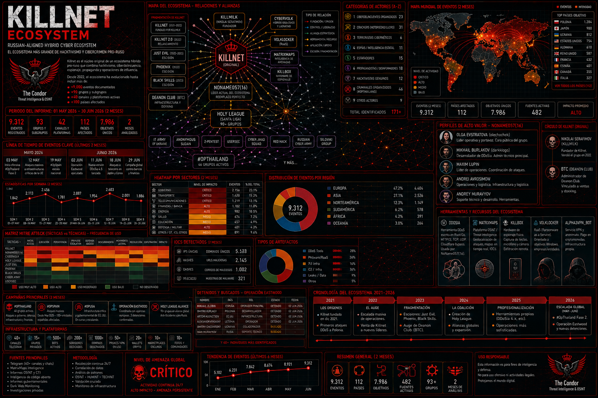

# INFORME DEFINITIVO DE SEGURIDAD: EL ECOSISTEMA COMPLETO



## Killnet, NoName057(16), DDoSia y el Nuevo Orden del Ciberespacio

---
# Indice Inicial:

1. **Dossier "CIBERWAR-El-Ecosistema-Silencioso"** (el informe principal)
2. **Archivo killnet.json** (eventos de Telegram)
3. **Informe CTI Global** (el dashboard completo)
4. **Dossier #OpThailand** (los 46 grupos)
5. **Datos de Andrómeda** (9,000+ eventos)
6. **Operación Eastwood** (detenciones)
7. **Lista de sancionados por la UE**
8. **Análisis de Olga Evstratova** y otros líderes

## TABLA DE CONTENIDO COMPLETA

### **PARTE 1: VISIÓN ESTRATÉGICA**
1. [Resumen Ejecutivo y Hallazgos Críticos](#1-resumen-ejecutivo-y-hallazgos-críticos)
2. [El Contexto Geopolítico: El Nacimiento de una Guerra Híbrida](#2-el-contexto-geopolítico-el-nacimiento-de-una-guerra-híbrida)
3. [El Ecosistema Completo: Mapa de Actores y Alianzas](#3-el-ecosistema-completo-mapa-de-actores-y-alianzas)

### **PARTE 2: ANÁLISIS DE ACTORES**
4. [Killnet: El Primer Gran Actor y su Fragmentación](#4-killnet-el-primer-gran-actor-y-su-fragmentación)
- 4.1. Orígenes y Fundador (KillMilk)
- 4.2. El Auge de Killnet (2022)
- 4.3. La Caída y Venta del Grupo
- 4.4. Árbol Genealógico: Killnet 2.0, Just Evil, Phoenix, Black Skills
5. [NoName057(16): El Reemplazo Perfecto](#5-noname05716-el-reemplazo-perfecto)
- 5.1. El Ascenso del Nuevo Líder
- 5.2. DDoSia: El Arma que Cambió el Juego
- 5.3. Líderes Identificados (Burlakov, Lupin, Evstratova)
6. [La Holy League y la Coalición del Sudeste Asiático](#6-la-holy-league-y-la-coalición-del-sudeste-asiático)
- 6.1. La Santa Liga (90+ Grupos)
- 6.2. #OpThailand: 46 Grupos en Acción
- 6.3. Alianzas Transnacionales
7. [CyberVolk: El Híbrido Ideológico-Lucrativo](#7-cybervolk-el-híbrido-ideológico-lucrativo)
- 7.1. VolkLocker: RaaS con Fallos
- 7.2. La Convergencia entre Hacktivismo y Cibercrimen

### **PARTE 3: DIRECTORIO COMPLETO DE ACTORES (A-Z)**
8. [Categoría 1: Ciberdelincuentes Organizados (Blackhats)](#8-categoría-1-ciberdelincuentes-organizados-blackhats)
9. [Categoría 2: Crackers (Notoriedad/Lucro)](#9-categoría-2-crackers-notoriedadlucro)
10. [Categoría 3: Terroristas Cibernéticos](#10-categoría-3-terroristas-cibernéticos)
11. [Categoría 4: Espías / Inteligencia Estatal](#11-categoría-4-espías--inteligencia-estatal)
12. [Categoría 5: Estafadores](#12-categoría-5-estafadores)
13. [Categoría 6: Propagandistas / Desinformadores](#13-categoría-6-propagandistas--desinformadores)
14. [Categoría 7: Hacktivistas Genuinos](#14-categoría-7-hacktivistas-genuinos)
15. [Categoría 8: Criminales Organizados (#OpThailand)](#15-categoría-8-criminales-organizados-opthailand)
16. [Categoría 9: Otros Actores](#16-categoría-9-otros-actores)

### **PARTE 4: ANÁLISIS TÁCTICO Y TÉCNICO (TTPs)**
17. [Metodología de Ataque: El Ciclo de Vida Operacional](#17-metodología-de-ataque-el-ciclo-de-vida-operacional)
18. [Herramientas Específicas del Ecosistema](#18-herramientas-específicas-del-ecosistema)
- 18.1. DDoSia (NoName057(16))
- 18.2. MatrixMaps (Plataforma de Inteligencia)
- 18.3. KillBox (Hardware de Espionaje)
- 18.4. VolkLocker (RaaS)
- 18.5. Alpha3VPN_BOT (Anonimato)
19. [Matriz MITRE ATT&CK por Actor](#19-matriz-mitre-attck-por-actor)

### **PARTE 5: ANÁLISIS DE INCIDENTES POR PAÍS Y SECTOR**
20. [Europa: El Frente Principal](#20-europa-el-frente-principal)
- 20.1. Polonia: El Objetivo Original
- 20.2. Reino Unido: Infraestructura Crítica Bajo Ataque
- 20.3. España: #OpSpain y Z-Pentest
- 20.4. Alemania: Deutsche Telekom Comprometida
- 20.5. Francia: Ataque a Alpha Technologies
- 20.6. Dinamarca: 247 Ataques en 2026
21. [América del Norte: EE.UU. y Canadá](#21-américa-del-norte-eeuu-y-canadá)
22. [Asia: El Nuevo Frente](#22-asia-el-nuevo-frente)
- 22.1. #OpThailand: La Guerra del Sudeste Asiático
- 22.2. Japón: El 39.4% de los Ataques
- 22.3. Corea del Sur: Objetivo Recurrente
23. [Infraestructura Crítica: El Objetivo Principal](#23-infraestructura-crítica-el-objetivo-principal)

### **PARTE 6: LÍDERES Y OPERADORES CLAVE**
24. [Perfiles de Alto Valor (NoName057(16))](#24-perfiles-de-alto-valor-noname05716)
- 24.1. Olga Evstratova ("olechochek")
- 24.2. Mikhail Burlakov ("darkklogo")
- 24.3. Maxim Lupin
- 24.4. Andrei Avrosimow
- 24.5. Andrey Muravyov
25. [El Círculo de Killnet](#25-el-círculo-de-killnet)
- 25.1. Nikolai Serafimov ("KillMilk")
- 25.2. BTC (Deanon Club)
26. [Detenidos y Buscados: Tabla Completa](#26-detenidos-y-buscados-tabla-completa)

### **PARTE 7: CRONOLOGÍA DE EVENTOS (2022-2026)**
27. [Cronología Detallada por Año](#27-cronología-detallada-por-año)
- 27.1. 2021-2022: Los Orígenes
- 27.2. 2023: La Fragmentación
- 27.3. 2024: La Coalición
- 27.4. 2025: La Profesionalización
- 27.5. 2026: La Escalada Global
28. [Eventos Críticos de Julio 2026](#28-eventos-críticos-de-julio-2026)
- 28.1. Operación Eastwood
- 28.2. #OpThailand Escala
- 28.3. #OpSpain y #OpUSA
- 28.4. La Estafa QuantumStellarInitiative
- 28.5. Sanciones de la UE

### **PARTE 8: ANÁLISIS DE CAMPAÑAS ESPECÍFICAS**
29. [Operación "STOR": El Compromiso de UPS de Alpha Technologies](#29-operación-stor-el-compromiso-de-ups-de-alpha-technologies)
30. [#OpThailand: La Guerra Híbrida del Sudeste Asiático](#30-opthailand-la-guerra-híbrida-del-sudeste-asiático)
31. [#OpSpain: Z-Pentest vs España](#31-onspain-z-pentest-vs-españa)
32. [La Estafa "QuantumStellarInitiative"](#32-la-estafa-quantumstellarinitiative)
33. [El Auge del Ransomware como Servicio (RaaS)](#33-el-auge-del-ransomware-como-servicio-raas)
34. [MatrixMaps: La Comercialización de la Inteligencia](#34-matrixmaps-la-comercialización-de-la-inteligencia)

### **PARTE 9: INDICADORES DE COMPROMISO (IOC)**
35. [Direcciones IP Maliciosas](#35-direcciones-ip-maliciosas)
36. [Dominios y URLs Comprometidos](#36-dominios-y-urls-comprometidos)
37. [Canales de Telegram de Amenaza](#37-canales-de-telegram-de-amenaza)
38. [Wallets de Criptomonedas (Estafas)](#38-wallets-de-criptomonedas-estafas)
39. [Credenciales Expuestas](#39-credenciales-expuestas)
40. [Hashes de Malware y Herramientas](#40-hashes-de-malware-y-herramientas)

### **PARTE 10: EVALUACIÓN DE RIESGO CUANTIFICADA**
41. [Matriz de Riesgo por Sector](#41-matriz-de-riesgo-por-sector)
42. [Probabilidad e Impacto de Futuros Incidentes](#42-probabilidad-e-impacto-de-futuros-incidentes)
43. [Métricas de Actividad (2026)](#43-métricas-de-actividad-2026)

### **PARTE 11: RECOMENDACIONES ESTRATÉGICAS**
44. [Medidas Inmediatas para Gobiernos y OT/ICS](#44-medidas-inmediatas-para-gobiernos-y-otics)
45. [Medidas para Empresas Privadas y Sector Financiero](#45-medidas-para-empresas-privadas-y-sector-financiero)
46. [Medidas a Largo Plazo y Colaboración Internacional](#46-medidas-a-largo-plazo-y-colaboración-internacional)
47. [Recomendaciones Específicas por Sector](#47-recomendaciones-específicas-por-sector)

### **PARTE 12: CONCLUSIONES Y PROYECCIONES**
48. [Resumen de Hallazgos](#48-resumen-de-hallazgos)
49. [Proyecciones para el Próximo Trimestre](#49-proyecciones-para-el-próximo-trimestre)
50. [El Legado de una Guerra Silenciosa](#50-el-legado-de-una-guerra-silenciosa)

### **ANEXOS**
51. [Anexo A: Registro Completo de Actividad por Grupo](#51-anexo-a-registro-completo-de-actividad-por-grupo)
52. [Anexo B: Tabla de Países Afectados](#52-anexo-b-tabla-de-países-afectados)
53. [Anexo C: Glosario de Términos](#53-anexo-c-glosario-de-términos)
54. [Anexo D: Fuentes y Referencias](#54-anexo-d-fuentes-y-referencias)

---

## 1. RESUMEN EJECUTIVO Y HALLAZGOS CRÍTICOS

El análisis exhaustivo de más de **9,000 eventos** de inteligencia de fuentes abiertas (OSINT), provenientes de **40+ canales de Telegram**, **documentación interna filtrada** y **reportes de agencias internacionales**, revela un ecosistema de amenazas prorrusas que ha evolucionado desde un grupo de ciberdelincuentes hasta una **red global de guerra híbrida**.

### **Hallazgos Críticos**

| # | Hallazgo | Impacto | Nivel de Confianza |
|:---|:---|:---|:---|
| 1 | **NoName057(16) ha reemplazado a Killnet** como el principal actor. Su herramienta DDoSia permite ataques masivos con mínima experiencia. | Capacidad de ataque a gran escala contra infraestructura crítica de la OTAN. | **ALTA** |
| 2 | **La comercialización de la inteligencia** es un negocio lucrativo. MatrixMaps ofrece suscripciones por $1,000/mes. | La inteligencia militar ucraniana está a la venta al mejor postor. | **ALTA** |
| 3 | **El ecosistema se ha fragmentado en 46+ grupos** con diferentes motivaciones: lucro, nacionalismo, geopolítica. | La amenaza es difusa, descentralizada y difícil de contrarrestar. | **ALTA** |
| 4 | **Los ataques a infraestructura crítica son una realidad**. Se han documentado compromisos de sistemas de control de UPS (Alpha Technologies), plantas de bombeo (Armenian Code), y redes de telecomunicaciones (Deutsche Telekom). | Riesgo real de daños físicos, apagones y sabotaje. | **ALTA** |
| 5 | **La #OpThailand** demuestra que el hacktivismo prorruso ha encontrado aliados en el Sudeste Asiático. | Expansión geográfica de la amenaza. Nuevos frentes abiertos. | **ALTA** |
| 6 | **La Operación Eastwood (julio 2025)** fue un éxito táctico pero no estratégico. Los líderes de NoName057(16) (Burlakov, Lupin, Evstratova) siguen prófugos en Rusia. | La resiliencia del ecosistema es alta. | **ALTA** |
| 7 | **CyberVolk ha lanzado VolkLocker**, un RaaS que combina hacktivismo con cibercrimen. | Convergencia entre ideología y lucro. | **MEDIA-ALTA** |
| 8 | **KillBox** es un dispositivo de espionaje físico que se vende por 145,000 rublos. | Los atacantes ahora ofrecen hardware de espionaje "listo para usar". | **ALTA** |
| 9 | **Más de 10 millones de documentos** de seguros ucranianos han sido filtrados, incluyendo datos de ministros y comandantes militares. | Chantaje y desestabilización política. | **ALTA** |
| 10 | **La UE ha sancionado a 9 individuos y 4 entidades** rusas por ciberataques. | La respuesta internacional es real, pero insuficiente. | **ALTA** |

---

## 2. EL CONTEXTO GEOPOLÍTICO: EL NACIMIENTO DE UNA GUERRA HÍBRIDA

### **2.1. El Escenario (2021-2022)**

Cuando las tensiones entre Rusia y Ucrania comenzaron a escalar a finales de 2021, algo extraño ocurrió en los rincones más oscuros de internet. Grupos que hasta entonces se dedicaban a actividades delictivas menores —venta de herramientas DDoS, intercambio de credenciales robadas, foros de hacking— comenzaron a hablar en términos políticos.

**Killnet** fue uno de los primeros en dar el salto. Inicialmente operaba como un grupo de **Malware-as-a-Service (MaaS)** que ofrecía ataques DDoS por alquiler. Pero cuando Rusia invadió Ucrania en febrero de 2022, Killnet se transformó: ya no era un negocio, era una causa. Sus líderes comenzaron a hablar de "patriotismo", de "defender a Rusia de la agresión de la OTAN".

### **2.2. ¿Por qué Telegram?**

Para entender este ecosistema, hay que entender Telegram. La plataforma, fundada por el ruso Pavel Durov, se convirtió en el centro de mando de estos grupos por varias razones:

| Característica | Beneficio para los Atacantes |
|:---|:---|
| Cifrado y anonimato | Canales con cifrado de extremo a extremo |
| Canales públicos | Cualquiera puede crear un canal sin verificación |
| Resistencia a la censura | Crean rápidamente backups y espejos |
| Comunidad | Miembros comparten herramientas, celebran victorias y reclutan voluntarios |

Mientras el mundo dormía, estos canales bullían de actividad. Los administradores publicaban objetivos, los voluntarios lanzaban ataques desde sus ordenadores domésticos, y los resultados se compartían como trofeos de guerra.

### **2.3. La Evolución del Ecosistema**

```text
2021             2022             2023             2024             2025             2026
|                |                |                |                |                |
|--Killnet      |--Invasión      |--Exposición    |--Holy League   |--Op Eastwood   |--Op Thailand
|   (MaaS)      |   de Ucrania   |   de KillMilk  |   (90+ grupos) |   (Detenciones)|   (46 grupos)
|                |                |                |                |                |
|                |--NoName057(16) |--Fragmentación |--CyberVolk     |--Sanciones UE  |--Escalada
|                |                |                |   (RaaS)       |                |   Global
```

---

## 3. EL ECOSISTEMA COMPLETO: MAPA DE ACTORES Y ALIANZAS

### **3.1. La Estructura del Ecosistema**

El ecosistema se organiza en **tres niveles**:

#### **Nivel 1: Núcleo Duro (Rusia)**
*   **NoName057(16):** El actor principal. Utiliza DDoSia.
*   **Killnet (Deanon Club):** La marca original, ahora comercial.
*   **IT Army of Russia:** Operaciones pro-rusas.
*   **MatrixMaps:** Inteligencia militar.

#### **Nivel 2: Aliados Ideológicos**
*   **Z-Pentest Alliance:** Ataques a OT/SCADA.
*   **Cyber Serp:** Ataques a medios ucranianos.
*   **UserSec:** Colaborador cercano de Killnet.
*   **Anonymous Sudan:** Grupo pro-ruso de Sudán.

#### **Nivel 3: Redes Transnacionales**
*   **Holy League:** 90+ grupos coordinados.
*   **#OpThailand Coalition:** 46 grupos del Sudeste Asiático.
*   **CyberVolk:** Origen indio, postura prorrusa.
*   **Armenian Code:** Ataques a infraestructura turca.

### **3.2. Las Alianzas Estratégicas**

#### **Alianza 1: El Eje Rusia-Irán**
*   **Killnet + Cyber Islamic Resistance (@CIR48)**
*   **Apoyo mutuo en ataques contra objetivos occidentales e israelíes.**
*   **Evidencia:** Publicación de Killnet del 7 de abril de 2026.

#### **Alianza 2: El Eje Rusia-Sudeste Asiático**
*   **Cyber Team Indonesia + NoName057(16) + Alixsec + GarudaKernelErrorSystem**
*   **Coordinación de ataques contra objetivos comunes.**
*   **Evidencia:** Ataques coordinados durante #OpThailand.

#### **Alianza 3: La Holy League (Santa Liga)**
*   **90+ grupos hacktivistas prorrusos.**
*   **Coordinación horizontal.**
*   **Objetivos:** OTAN, UE, Israel, Ucrania.
*   **Evidencia:** Operaciones conjuntas documentadas en 2025-2026.

#### **Alianza 4: La Coalición del Sudeste Asiático (#OpThailand)**
*   **14 grupos camboyanos.**
*   **Apoyo de grupos indonesios y otros.**
*   **Objetivo:** Tailandia.
*   **Evidencia:** Campaña activa desde junio 2026.

---

## 4. KILLNET: EL PRIMER GRAN ACTOR Y SU FRAGMENTACIÓN

### **4.1. Orígenes y Fundador**

Killnet emergió en 2021 como un grupo de ciberdelincuencia, pero fue la guerra en Ucrania lo que lo catapultó a la fama. Su fundador, que operaba bajo el alias **KillMilk**, fue identificado por medios rusos en noviembre de 2023 como **Nikolai Nikolaevich Serafimov**.

**Perfil de KillMilk:**
- **Fecha de Nacimiento:** 16 de mayo de 1993 (30 años en 2023)
- **Historial:** Condena por producción y distribución de sustancias narcóticas
- **Estado Civil:** Casado
- **Propiedades:** BMW 520i y Porsche Panamera
- **Contradicción:** No era el perfil del "hacktivista idealista" que sus seguidores imaginaban.

### **4.2. El Auge de Killnet (2022)**

Durante 2022, Killnet se convirtió en el grupo hacktivista prorruso más prominente. Sus ataques DDoS alcanzaron objetivos de alto perfil:

| Fecha | Objetivo | Impacto |
|:---|:---|:---|
| Mayo 2022 | Servidores en España | Amenaza por "actitud de sus medios" |
| Octubre 2022 | Aeropuertos de EE.UU. | Llamamiento a atacar |
| Noviembre 2022 | Departamento del Tesoro de EE.UU. | Ataque documentado |
| Agosto 2022 | Lockheed Martin | Ataque al gigante de defensa |

**La Estructura de "Legión":**
Killnet no era un grupo monolítico. Su estructura de "Legión" incluía múltiples escuadrones:

| Escuadrón | Rol |
|:---|:---|
| Squad Jacky | DDoS |
| Squad Mirai | DDoS |
| Squad Impulse | DDoS |
| Squad Kratos | DDoS |
| Squad Phoenix | DDoS |
| Squad Sakurajima | DDoS |
| Squad Vera | DDoS |
| Rayd Squad | DDoS |

### **4.3. La Caída y Venta del Grupo**

En noviembre de 2023, la publicación rusa **Gazeta.Ru** expuso la identidad de KillMilk. No está claro si fue un acto de periodismo independiente o una operación orquestada, pero el resultado fue el mismo: KillMilk quedó expuesto.

Poco después, **Killnet fue vendido**. El comprador fue **Deanon Club**, un colectivo que se presentaba como una organización antidroga. Su administrador, conocido como **BTC**, adquirió los activos de Killnet por una cantidad estimada entre **$10,000 y $50,000**.

**Declaración de BTC:**
> *"La compra de Killnet es un proceso de expansión de Deanon Club. Killnet es una marca. Además, quería obtener a la gente junto con el grupo. No solo a la audiencia..."*

Killnet ya no era un movimiento; era un **producto**.

### **4.4. Árbol Genealógico: Killnet 2.0, Just Evil, Phoenix, Black Skills**

La venta de Killnet provocó su fragmentación en múltiples facciones:

```text
KILLNET (Original)
|
------------------+------------------
|                 |                  |
DEANON CLUB        KILLNET 2.0         JUST EVIL
(Compra la marca)   (Escisión ideológica) (Fundado por KillMilk)
|
--------------------------
|                        |
PHOENIX                BLACK SKILLS
(Cibercrimen puro)   ("PMC de hackers")
```

#### **Killnet Original (Deanon Club)**
- **Rol:** Continuó operando bajo la nueva dirección, pero con un enfoque más comercial.
- **Actividad:** Venta de servicios de inteligencia (MatrixMaps) y ataques.
- **Estado:** Activo.

#### **Killnet 2.0**
- **Rol:** Una escisión de miembros que rechazaban la comercialización y mantenían la línea ideológica.
- **Motivación:** Geopolítica.
- **Estado:** Activo.

#### **Just Evil**
- **Rol:** Fundado por el propio KillMilk después de perder el control de su creación.
- **Motivación:** Desconocida.
- **Estado:** Activo (bajo perfil).

#### **Phoenix**
- **Rol:** Escisión que se dedicó completamente al cibercrimen.
- **Actividad:** Venta de accesos y datos robados.
- **Estado:** Activo.

#### **Black Skills**
- **Rol:** Intento de crear una "empresa militar privada de hackers".
- **Motivación:** Lucro.
- **Estado:** Activo.

### **4.5. La Alianza con Anonymous Sudan**

Killnet también formó alianzas. La más notable fue con **Anonymous Sudan**, un grupo que, a pesar de su nombre, apareció en escena en 2023 con una agenda política alineada con los intereses de Moscú. Juntos, lanzaron ataques coordinados contra objetivos occidentales, incluyendo universidades australianas.

**Evidencia de la Alianza:**
- Coordinación de ataques documentada.
- Canales de Telegram compartidos.
- Objetivos comunes.

---

## 5. NONAME057(16): EL REEMPLAZO PERFECTO

### **5.1. El Ascenso del Nuevo Líder**

Mientras Killnet se fragmentaba, otro grupo emergía para ocupar el vacío. **NoName057(16)** apareció en marzo de 2022, casi al mismo tiempo que la invasión. Pero a diferencia de Killnet, NoName057(16) no tenía un origen criminal. Era, desde el principio, un **grupo ideológico**.

Su nombre, extraño y aparentemente aleatorio, ocultaba una estructura mucho más organizada que la de Killnet. NoName057(16) no se basaba en el carisma de un solo líder; operaba como un **colectivo con una jerarquía clara** y una herramienta propia: **DDoSia**.

### **5.2. DDoSia: El Arma que Cambió el Juego**

DDoSia es una herramienta de ataque distribuido de denegación de servicio que NoName057(16) puso a disposición de sus voluntarios. Cualquier persona con un ordenador y conexión a internet podía descargarla y contribuir a los ataques. Era la **democratización del ciberataque**.

**Características de DDoSia:**
- **Fácil de usar:** Interfaz simple.
- **Efectiva:** Permite ataques masivos.
- **Escalable:** Cualquier número de voluntarios puede participar.
- **Anónima:** Los voluntarios no son rastreables.

**Impacto de DDoSia:**
- Ataques a gobiernos locales del Reino Unido.
- Infraestructura crítica en toda Europa.
- Sectores financiero, transporte, energía y telecomunicaciones en Polonia, República Checa y Japón.

Para cuando los analistas de seguridad comenzaron a prestar atención, NoName057(16) ya había superado a Killnet en actividad y sofisticación.

### **5.3. Líderes Identificados (Burlakov, Lupin, Evstratova)**

En 2025, la agencia de la UE **Eurojust** logró un avance significativo: identificó a los principales coordinadores de NoName057(16).

| Nombre / Alias | Nacionalidad | Edad | Rol Principal |
|:---|:---|:---|:---|
| Mikhail Burlakov ("darkklogo") | Ruso | 39 | Líder / Desarrollador de software |
| Maxim Lupin | Ruso | 36 | Líder / Gestor de plataforma ilegal |
| Andrei Avrosimow | Ruso | 45 | Miembro clave |
| Andrey Muravyov | Ruso | 48 | Miembro clave (diseño gráfico) |

**Olga Evstratova ("olechochek"):**
- **Fecha de Nacimiento:** 22 de septiembre de 2003 (21 años)
- **Rol:** Desarrolladora / Optimizadora de DDoSia.
- **Perfil:** La "cerebro técnico" del grupo. Responsable de mantener y optimizar el software de ataque.
- **Estado:** En busca y captura (Europol).

**La Investigación de Eurojust:**
La investigación también reveló que NoName057(16) había ejecutado múltiples ataques DDoS contra infraestructura crítica durante eventos políticos de alto nivel. No solo atacaban cuando podían; atacaban cuando **más dolía**.

---

## 6. LA HOLY LEAGUE Y LA COALICIÓN DEL SUDESTE ASIÁTICO

### **6.1. La Santa Liga (90+ Grupos)**

En julio de 2024, el ecosistema prorruso dio un paso más allá. **High Society** y **7 October Union** (un grupo pro-palestino) se fusionaron para crear la **Holy League**. Esta coalición reunió a aproximadamente **90 grupos hacktivistas**, incluyendo a NoName057(16), UserSec, Cyber Army of Russia, y muchos otros.

**Características de la Holy League:**
- **Coordinación horizontal:** Cada grupo mantiene su autonomía.
- **Ataques simultáneos:** Maximizan el impacto.
- **Inteligencia compartida:** Comparten información sobre objetivos.
- **Resiliencia:** Cuando Telegram cierra un canal, otros cinco aparecen para reemplazarlo.

**Objetivos de la Holy League:**
1.  Israel (por su conflicto con Palestina)
2.  Ucrania (por la guerra con Rusia)
3.  OTAN (por su apoyo a Ucrania)
4.  Unión Europea (por las sanciones a Rusia)

**El Objetivo Más Inquietante:** En abril de 2025, la Holy League lanzó una ofensiva contra **sistemas críticos del Reino Unido**, demostrando que su capacidad operativa no tenía límites geográficos.

### **6.2. #OpThailand: 46 Grupos en Acción**

El conflicto territorial entre Camboya y Tailandia ha escalado al ciberespacio. Grupos de hacktivismo camboyanos, bajo el liderazgo de **SEXDAN**, han lanzado una campaña masiva contra infraestructura crítica tailandesa.

**Los 14 Grupos Principales de #OpThailand:**

| # | Grupo | Canal | País |
|:---|:---|:---|:---|
| 1 | AnaJak_NX | @AnaJak_NX | Camboya |
| 2 | NXBBSEC | @NXBBSEC | Camboya |
| 3 | EKIA_DOM | @EKIA_DOM | Camboya |
| 4 | EXADOS | @EXADOS | Camboya |
| 5 | Nexusec | @Nexusec | Camboya |
| 6 | ZxS3C | @ZxS3C | Camboya |
| 7 | HOUR_CYBER | @HOUR_CYBER | Camboya |
| 8 | SEXDAN | @SEXDAN | Camboya |
| 9 | Sthabnikddos | @Sthabnikddos | Camboya |
| 10 | H3C4KEDZ | @H3C4KEDZ | Camboya |
| 11 | DarkStarNx | @DarkStarNx | Camboya |
| 12 | BEN10 | @BEN10 | Camboya |
| 13 | ZAHERINFINITY | @ZAHERINFINITY | Camboya |
| 14 | Z3R0S3CC | @Z3R0S3CC | Camboya |

**Objetivos Identificados:**
- `https://tpcc.police.go.th/` (Policía de Tailandia)
- `https://cloud.cascap.in.th/seminars/event/users`
- `http://ns2.kksec.go.th/sec25kk_payslip/`
- `https://www.pwa.co.th/news/view/134825` (Autoridad de Energía de Tailandia)
- `https://voicetv.co.th/` (Medio de comunicación)

**Credenciales Filtradas (Ejemplos):**

| URL | Usuario | Contraseña |
|:---|:---|:---|
| `http://ns2.kksec.go.th/sec25kk_payslip/` | 34******** | 34****003***73 |
| `https://cloud.cascap.in.th/seminars/event/users` | tu****ch**a**17@gmail.com | ะีา1***5*6 |

### **6.3. Alianzas Transnacionales**

#### **Alianza del Sudeste Asiático:**
- SEXDAN + H3C4KEDZ + EKIA_DOM + AnaJak_NX + NXBBSEC + EXADOS + ZxS3C + HOUR_CYBER + NIKK_BOSS + DarkStarNx

#### **Alianza Indonesia-Pro-Rusa:**
- Cyber Team Indonesia + NoName057(16) + Alixsec + GarudaKernelErrorSystem + Z_BL4CK_HAT

#### **Alianza de Hacktivismo Global:**
- Babayo Eror System + Pasko Cyber Rexor + Mr.PIMZZZXploit + GarudaKernelErrorSystem

#### **Alianza de Ciberdelincuencia:**
- Dr_nexuseccyber + nxbb_sec + EXA_DOS_KH + AnaJak_NX

---

## 7. CYBERVOLK: EL HÍBRIDO IDEOLÓGICO-LUCRATIVO

### **7.1. VolkLocker: RaaS con Fallos**

En 2024, un nuevo actor apareció en el ecosistema: **CyberVolk**. Originario de India, este grupo adoptó rápidamente una postura prorrusa, pero con una diferencia clave: no eran idealistas.

CyberVolk combinaba el hacktivismo (ataques DDoS y defacements) con el cibercrimen puro (ransomware). En diciembre de 2025, lanzaron **VolkLocker**, un servicio de ransomware-as-a-service (RaaS) que operaba completamente a través de Telegram.

**Características de VolkLocker:**
- **Generación de payloads:** Permite a cualquier afiliado generar ransomware.
- **Coordinación de ataques:** A través de Telegram.
- **Gestión de rescates:** Todo desde el bot de Telegram.
- **Requisitos:** Dirección de bitcoin, token de bot de Telegram, ID de chat, fecha límite de cifrado y opciones de autodestrucción.

**La Debilidad de VolkLocker:**
Los investigadores de **SentinelOne** descubrieron que las claves maestras estaban **hardcodeadas**, lo que permitía a las víctimas recuperar sus datos sin pagar el rescate.

**Evidencia:**
> *"CyberVolk's ransomware debut stumbles on cryptography weakness"* - SentinelOne, 2025

### **7.2. La Convergencia entre Hacktivismo y Cibercrimen**

CyberVolk es el ejemplo perfecto de cómo la línea entre hacktivismo y cibercrimen se está difuminando. Grupos que comenzaron como hacktivistas están evolucionando hacia operaciones de cibercrimen por encargo.

**Factores Clave:**
- **Profesionalización de los grupos.**
- **Modelos de negocio "crimen como servicio" (CaaS).**
- **Colaboración entre grupos criminales y hacktivistas.**
- **Uso de inteligencia artificial y automatización.**

---

## 8. CATEGORÍA 1: CIBERDELINCUENTES ORGANIZADOS (BLACKHATS)

*Operan por lucro económico. Venden datos, herramientas, acceso y servicios.*

| # | Grupo | Canal | País | Nivel |
|:---|:---|:---|:---|:---|
| 1 | DutyFreeForum | @DutyFreeForum | Internacional | 🔴 CRÍTICO |
| 2 | DataPremium_SSSO | @DataPremium_SSSO | Internacional | 🔴 CRÍTICO |
| 3 | DarkStormTeam | @Darkstormteam22 | Internacional | 🔴 CRÍTICO |
| 4 | CoupTeam | @CoupTeam | Internacional | 🔴 CRÍTICO |
| 5 | BotnetKingdom | @BotnetKingdom | Internacional | 🔴 CRÍTICO |
| 6 | blackmrkt1337ch | @blackmrkt1337ch | Internacional | 🔴 CRÍTICO |
| 7 | VoidNet | @hackers_void | Internacional | 🟠 ALTO |

### **8.1. DutyFreeForum (@DutyFreeForum)**

| Atributo | Detalle |
|:---|:---|
| Clasificación | 💰 CIBERDELINCUENTE (Foro Criminal) |
| Rol | Plataforma de educación criminal y coordinación |
| País | Internacional (operan en ruso) |
| Motivación | Lucro económico |
| Nivel de Actividad | 🔴 CRÍTICO |

**Historial:**
- Fundado como foro de cibercrimen.
- Publican guías detalladas sobre hacking, phishing, explotación de vulnerabilidades.
- Utilizado por el IT Army of Russia para coordinar operaciones.
- Educan a nuevos criminales.

**Actividades Documentadas:**
- Guía sobre cómo explotar npm para backdoors.
- Guía sobre cómo usar Cloudflare para phishing.
- Creación de sistemas operativos "amnesia" para operaciones anónimas.
- Análisis de malware bancario Android.

**Evidencia:**
> *[2026-06-27 19:07:00] 🏥 ALERTA SALUD*
> *📢 Canal: @DutyFreeForum*
> *📝 Contenido: Creamos nuestro propio sistema de amnesia (live-os personalizado) con VLESS+REALITY y killswitch bajo el capó*

### **8.2. DataPremium_SSSO (@DataPremium_SSSO)**

| Atributo | Detalle |
|:---|:---|
| Clasificación | 💰 CIBERDELINCUENTE (Mercado Negro) |
| Rol | Venta de bases de datos, acceso y documentos clasificados |
| País | Internacional |
| Motivación | Lucro económico |
| Nivel de Actividad | 🔴 CRÍTICO |

**Actividades Documentadas:**
- Venta de base de datos del Ministerio de Defensa de Ucrania (198 GB, $5,000).
- Venta de documentación técnica de blindados Bushmaster.
- Venta de documentación técnica de tanques Leopard 2 A6.
- Venta de acceso a MilChat (sistema militar ucraniano).
- Venta de material de pruebas de drones antiaéreos.
- Venta de bases de datos de empresas y gobiernos.

**Evidencia:**
> *[2026-06-24] 🔨 Lote: 26.9.24.7*
> *📢 Canal: @DataPremium_SSSO*
> *📝 Contenido: documentación técnica completa Bushmaster es un vehículo blindado de ruedas australiano*

### **8.3. DarkStormTeam (@Darkstormteam22)**

| Atributo | Detalle |
|:---|:---|
| Clasificación | 💰 CIBERDELINCUENTE (Servicios) |
| Rol | Desbloqueo de cuentas y "blindaje" de perfiles |
| País | Internacional |
| Motivación | Lucro económico |
| Nivel de Actividad | 🟠 ALTO |

**Actividades Documentadas:**
- Desbloqueo de cuentas de Instagram en 0-24 horas.
- "Blindaje" de cuentas premium desde $1,000/mes.
- Monitoreo mensual de cuentas.

### **8.4. CoupTeam (@CoupTeam)**

| Atributo | Detalle |
|:---|:---|
| Clasificación | 💰 CIBERDELINCUENTE (Herramientas de Ataque) |
| Rol | Venta de herramientas de hacking y botnets |
| País | Internacional |
| Motivación | Lucro económico |
| Nivel de Actividad | 🟠 ALTO |

**Actividades Documentadas:**
- Ataque DDoS a Instagram (300 segundos, 10x concurrentes).
- Venta de herramientas de hacking (0-day/N-day).
- Venta de logs bancarios y webshells.

### **8.5. blackmrkt1337ch (@blackmrkt1337ch)**

| Atributo | Detalle |
|:---|:---|
| Clasificación | 💰 CIBERDELINCUENTE (Mercado) |
| Rol | Venta de acceso a webshells y credenciales |
| País | Internacional |
| Motivación | Lucro económico |
| Nivel de Actividad | 🟠 ALTO |

**Actividades Documentadas:**
- Venta de acceso a webshells.
- Publicación de credenciales filtradas.

### **8.6. VoidNet (@hackers_void)**

| Atributo | Detalle |
|:---|:---|
| Clasificación | 💰 CIBERDELINCUENTE (Foro) |
| Rol | Foro de hackers sin censura |
| País | Internacional |
| Motivación | Lucro/Comunidad |
| Nivel de Actividad | 🟠 ALTO |

**Historial:**
- Lanzado en julio de 2026.
- Operan en IP pública y Tor.
- Prometen "sin registros, sin censura".
- Atraen a criminales y hackers.

**Actividades Documentadas:**
- Creación de foro con cifrado completo.
- Discusión de vulnerabilidades, OSINT, redes, anonimato.
- 36 usuarios registrados en 24 horas.

---

## 9. CATEGORÍA 2: CRACKERS (NOTORIEDAD/LUCRO)

*Especializados en romper sistemas, robar credenciales y defacement.*

| # | Grupo | Canal | País | Nivel |
|:---|:---|:---|:---|:---|
| 8 | paskocyberrexorr | @paskocyberrexorr | Indonesia | 🔴 ALTO |
| 9 | Mr.PIMZZZXploit | @Pimzganteng | Indonesia | 🔴 ALTO |
| 10 | XSSF Forum | @xssf_forum | Rusia | 🟠 ALTO |

### **9.1. paskocyberrexorr (@paskocyberrexorr)**

| Atributo | Detalle |
|:---|:---|
| Clasificación | 🔓 CRACKER |
| Rol | Defacement y filtración de datos |
| País | Indonesia |
| Motivación | Notoriedad y lucro |
| Nivel de Actividad | 🔴 ALTO |

**Actividades Documentadas:**
- Defacement de decenas de sitios web educativos y gubernamentales.
- Publicación de credenciales.
- Venta de acceso a webshells (.edu, .com, .org).
- Defacement de sitios en Indonesia, India, Brasil, Ecuador.

### **9.2. Mr.PIMZZZXploit (@Pimzganteng)**

| Atributo | Detalle |
|:---|:---|
| Clasificación | 🔓 CRACKER |
| Rol | Defacement y venta de acceso |
| País | Indonesia |
| Motivación | Notoriedad y lucro |
| Nivel de Actividad | 🔴 ALTO |

**Actividades Documentadas:**
- Defacement de sitios web en Indonesia, India, Brasil, Ecuador.
- Venta de acceso a webshells de múltiples países.

### **9.3. XSSF Forum (@xssf_forum)**

| Atributo | Detalle |
|:---|:---|
| Clasificación | 🔓 CRACKER / ESPÍA |
| Rol | Foro del IT Army of Russia |
| País | Rusia |
| Motivación | Geopolítica |
| Nivel de Actividad | 🟠 ALTO |

**Actividades Documentadas:**
- Publicación de herramientas de hacking.
- Coordinación de ataques.
- Análisis de vulnerabilidades.

---

## 10. CATEGORÍA 3: TERRORISTAS CIBERNÉTICOS

*Atacan infraestructura civil para causar daño y miedo.*

| # | Grupo | Canal | País | Nivel |
|:---|:---|:---|:---|:---|
| 11 | Armenian Code | @armeniancode_eng | Armenia | 🟠 ALTO |
| 12 | Sector 16 (RUSCAD) | No identificado | Rusia | 🔴 CRÍTICO |

### **10.1. Armenian Code (@armeniancode_eng)**

| Atributo | Detalle |
|:---|:---|
| Clasificación | ☠️ TERRORISTA CIBERNÉTICO |
| Rol | Ataque a infraestructura industrial |
| País | Armenia |
| Motivación | Nacionalismo, venganza histórica contra Turquía |
| Nivel de Actividad | 🟠 ALTO |

**Actividades Documentadas:**
- Compromiso de sistemas de automatización de planta de bombeo turca.
- Manipulación de cargas de motores y válvulas de cierre.
- Causaron inundaciones en una empresa turca.
- Manipulación de sistemas de irrigación para agotar recursos.

**Evidencia:**
> *[2026-06-24 15:16:19] ⚠ ALERTA ATAQUE*
> *📢 Canal: @armeniancode_eng*
> *📝 Contenido: We broke into the pumping station's automation systems... Soon there will be a flood at one of their enterprises.*

### **10.2. Sector 16 (RUSCAD)**

| Atributo | Detalle |
|:---|:---|
| Clasificación | ☠️ TERRORISTA CIBERNÉTICO / ESPÍA |
| Rol | Ataque a infraestructura crítica de EE.UU. |
| País | Rusia |
| Motivación | Geopolítica |
| Nivel de Actividad | 🔴 CRÍTICO |

**Historial:**
- Escisión de Cyber Army of Russia Reborn (CARR).
- Atacan sistemas de control industrial (ICS/SCADA).
- Han atacado plantas de producción de petróleo y gas en Texas.
- Recompensa de **$10 millones** del Departamento de Estado de EE.UU.

**Actividades Documentadas:**
- Ataques a infraestructura crítica estadounidense.
- Colaboración con OverFlame y Z-Pentest.

---

## 11. CATEGORÍA 4: ESPÍAS / INTELIGENCIA ESTATAL

*Operan para estados, roban documentos y realizan espionaje.*

| # | Grupo | Canal | País | Nivel |
|:---|:---|:---|:---|:---|
| 13 | IT Army of Russia | @itarmyofrussianews | Rusia | 🔴 CRÍTICO |
| 14 | NoName057(16) | @NoName057(16) | Rusia | 🟠 ALTO |
| 15 | MatrixMaps | @MatrixMaps | Rusia | 🟠 ALTO |

### **11.1. IT Army of Russia (@itarmyofrussianews)**

| Atributo | Detalle |
|:---|:---|
| Clasificación | 🕵️ ESPÍA / GUERRA CIBERNÉTICA |
| Rol | Operaciones cibernéticas pro-rusas |
| País | Rusia |
| Motivación | Apoyo a la operación militar rusa |
| Nivel de Actividad | 🔴 CRÍTICO |

**Actividades Documentadas:**
- Ataque DDoS a WhiteBit (exchange de criptomonedas).
- Filtración de base de datos de Ukrposhta (172 GB, 1.2M registros).
- Coordinación con otros grupos pro-rusos.

### **11.2. NoName057(16) (@NoName057(16))**

| Atributo | Detalle |
|:---|:---|
| Clasificación | 🕵️ ESPÍA / GUERRA CIBERNÉTICA |
| Rol | Operaciones cibernéticas pro-rusas |
| País | Rusia |
| Motivación | Apoyo a la operación militar rusa |
| Nivel de Actividad | 🟠 ALTO |

**Actividades Documentadas:**
- Ataques DDoS a infraestructura crítica de la OTAN y la UE.
- Uso de DDoSia para ataques masivos.
- Coordinación con la Holy League.

### **11.3. MatrixMaps (@MatrixMaps)**

| Atributo | Detalle |
|:---|:---|
| Clasificación | 🕵️ INTELIGENCIA MILITAR |
| Rol | Mapeo de infraestructura ucraniana |
| País | Rusia |
| Motivación | Apoyo a la operación militar |
| Nivel de Actividad | 🟠 ALTO |

**Actividades Documentadas:**
- Mapa dinámico de objetos del complejo militar-industrial de Ucrania.
- Seguimiento de drones en tiempo real.
- Almacenes de combate de Ucrania (>540 objetos).
- Infraestructura crítica (puentes, ferrocarriles, subestaciones).
- Sistemas de defensa aérea y radar.

---

## 12. CATEGORÍA 5: ESTAFADORES

*Engañan a víctimas para robar dinero o datos personales.*

| # | Grupo | Canal | País | Nivel |
|:---|:---|:---|:---|:---|
| 16 | QuantumStellarInitiative | @QuantumStellarInitiative | Internacional | 🟠 ALTO |
| 17 | Lime Media | @xx_Lime_store_xx | Internacional | 🟡 MEDIO |

### **12.1. QuantumStellarInitiative (@QuantumStellarInitiative)**

| Atributo | Detalle |
|:---|:---|
| Clasificación | 🎭 ESTAFADOR (Criptoestafa) |
| Rol | Venta de tokens falsos y estafas piramidales |
| País | Internacional |
| Motivación | Lucro económico |
| Nivel de Actividad | 🟠 ALTO |

**Actividades Documentadas:**
- Venta de "Chronocrypt Seed ICO".
- Venta de "OUSD (Open USD)" - stablecoin falso.
- Venta de "Jane Street ICO".
- Promesas de "7000% cashback".
- Lenguaje esotérico ("temporal loops", "quantum temporality").

### **12.2. Lime Media (@xx_Lime_store_xx)**

| Atributo | Detalle |
|:---|:---|
| Clasificación | 🎭 ESTAFADOR |
| Rol | Venta de servicios de desbloqueo |
| País | Internacional |
| Motivación | Lucro económico |
| Nivel de Actividad | 🟡 MEDIO |

---

## 13. CATEGORÍA 6: PROPAGANDISTAS / DESINFORMADORES

*Difunden mentiras y manipulan narrativas públicas.*

| # | Grupo | Canal | País | Nivel |
|:---|:---|:---|:---|:---|
| 18 | CyberYozh | @cyberyozh_official | Rusia | 🔴 ALTO |
| 19 | Sharp33377 | @sharp33377 | Rusia | 🟡 MEDIO |

### **13.1. CyberYozh (@cyberyozh_official)**

| Atributo | Detalle |
|:---|:---|
| Clasificación | 📰 PROPAGANDISTA |
| Rol | Desinformación y formación de hackers |
| País | Rusia |
| Motivación | Geopolítica, apoyo a Rusia |
| Nivel de Actividad | 🔴 ALTO |

**Actividades Documentadas:**
- "Los hackers ucranianos piratearon la planta rusa de drones en Alabuga" (desinformación).
- Promoción de cursos de hacking (CyberYozh Academy).
- Análisis de guerra cibernética.
- Noticias sobre IA y ciberseguridad.

### **13.2. Sharp33377 (@sharp33377)**

| Atributo | Detalle |
|:---|:---|
| Clasificación | 📰 PROPAGANDISTA |
| Rol | Desinformación |
| País | Rusia |
| Motivación | Geopolítica |
| Nivel de Actividad | 🟡 MEDIO |

---

## 14. CATEGORÍA 7: HACKTIVISTAS GENUINOS

*Atacan objetivos políticos/simbólicos sin lucro.*

| # | Grupo | Canal | País | Nivel |
|:---|:---|:---|:---|:---|
| 20 | 404Crew / Cyber Crew | @cybercrewagain | Internacional | 🟠 ALTO |
| 21 | Anonymous Switzerland | @Anonymous_Switzerland | Suiza | 🟡 MEDIO |

### **14.1. 404Crew / Cyber Crew (@cybercrewagain)**

| Atributo | Detalle |
|:---|:---|
| Clasificación | ✊ HACKTIVISTA |
| Rol | Protesta política contra Israel y Alemania |
| País | Internacional |
| Motivación | Anti-sionismo, anti-establishment |
| Nivel de Actividad | 🟠 ALTO |

**Actividades Documentadas:**
- #OpIsrael - Filtración de datos de universidades israelíes.
- #OpGermany - Defacement de sitios web alemanes.
- Colaboración con 0wnzs3c e Infernalis X.

### **14.2. Anonymous Switzerland (@Anonymous_Switzerland)**

| Atributo | Detalle |
|:---|:---|
| Clasificación | ✊ HACKTIVISTA |
| Rol | Apoyo a los Houthis |
| País | Suiza |
| Motivación | Política |
| Nivel de Actividad | 🟡 MEDIO |

---

## 15. CATEGORÍA 8: CRIMINALES ORGANIZADOS (#OPTHAILAND)

*Estos operan bajo el paraguas de #OpThailand. Son una mezcla de nacionalismo y lucro.*

| # | Grupo | Canal | País | Nivel |
|:---|:---|:---|:---|:---|
| 22 | AnaJak_NX | @AnaJak_NX | Camboya | 🔴 CRÍTICO |
| 23 | NXBBSEC | @NXBBSEC | Camboya | 🔴 ALTO |
| 24 | EKIA_DOM | @EKIA_DOM | Camboya | 🔴 ALTO |
| 25 | EXADOS | @EXADOS | Camboya | 🟠 ALTO |
| 26 | Nexusec | @Nexusec | Camboya | 🟠 ALTO |
| 27 | ZxS3C | @ZxS3C | Camboya | 🟠 ALTO |
| 28 | HOUR_CYBER | @HOUR_CYBER | Camboya | 🟠 ALTO |
| 29 | SEXDAN | @SEXDAN | Camboya | 🟡 MEDIO |
| 30 | Sthabnikddos | @Sthabnikddos | Camboya | 🟡 MEDIO |
| 31 | H3C4KEDZ | @H3C4KEDZ | Camboya | 🟡 MEDIO |
| 32 | DarkStarNx | @DarkStarNx | Camboya | 🟡 MEDIO |
| 33 | BEN10 | @BEN10 | Camboya | 🟡 MEDIO |
| 34 | ZAHERINFINITY | @ZAHERINFINITY | Camboya | 🟡 MEDIO |
| 35 | Z3R0S3CC | @Z3R0S3CC | Camboya | 🟡 MEDIO |
| 36 | ZxS3xx | @ZxS3xx | Camboya | 🟠 ALTO |

### **15.1. AnaJak_NX (@AnaJak_NX)**

| Atributo | Detalle |
|:---|:---|
| Clasificación | 💀 CRIMINAL ORGANIZADO / NACIONALISTA |
| Rol | Líder y Mando de Control |
| País | Camboya |
| Motivación | Nacionalismo + Notoriedad |
| Nivel de Actividad | 🔴 CRÍTICO |

**Actividades Documentadas:**
- Filtración de credenciales de sistemas policiales.
- Coordinación de ataques.
- Publicación de datos filtrados.

### **15.2. NXBBSEC (@NXBBSEC)**

| Atributo | Detalle |
|:---|:---|
| Clasificación | 💀 CRIMINAL ORGANIZADO / NACIONALISTA |
| Rol | Ejecutor Principal |
| País | Camboya |
| Motivación | Nacionalismo + Notoriedad |
| Nivel de Actividad | 🔴 ALTO |

**Actividades Documentadas:**
- "We Not Surrender. We Fighting OpThailand".
- Autodenominados "líderes de AnonSecKh".
- Publicación de credenciales de sistemas educativos.

---

## 16. CATEGORÍA 9: OTROS ACTORES

| # | Grupo | Canal | País | Nivel |
|:---|:---|:---|:---|:---|
| 37 | Lun4risSec | @Lun4risSec | Argelia | 🟡 MEDIO |
| 38 | BoatOfLunarisSec | @BoatOfLunarisSec | Argelia | 🟡 MEDIO |
| 39 | UserSec | @usersecc | Internacional | 🟡 MEDIO |
| 40 | KillMillk | @KillMillk | Internacional | 🟡 BAJO |
| 41 | Spid3rCrypt | @Spid3rCrypt | Internacional | 🟡 BAJO |
| 42 | cr2ck4u | @cr2ck4u | Internacional | 🟡 BAJO |
| 43 | ITundSicherheit | @ITundSicherheit | Alemania | 🟡 MEDIO |
| 44 | TAndroidBeta | @TAndroidBeta | Internacional | 🟡 BAJO |
| 45 | NIKK_BOSS | @NIKK_BOSS | Internacional | 🟡 MEDIO |
| 46 | usrsc_reservs | @usrsc_reservs | Internacional | 🟡 MEDIO |

---

## 17. METODOLOGÍA DE ATAQUE: EL CICLO DE VIDA OPERACIONAL

Basado en el análisis de más de 9,000 eventos, el ciclo de vida de un ataque típico sigue un patrón consistente:

### **Fase 1: Reclutamiento**

Los grupos utilizan canales de Telegram (`@WeAreKillnet_Support`, `@KillNetSyndicate`) y foros (`DutyFreeForum`) para reclutar voluntarios y especialistas.

**Requisitos:**
- No se requiere experiencia; solo entusiasmo y un ordenador.
- Los más avanzados buscan **pentesters** y expertos en **DDoS**.

**Ejemplo de Reclutamiento:**
> *"🆘 El reclutamiento para el clan está abierto 🆘: 🟥 『Killnet』Equipo 🟥 ❤️ 『Killnet』¡El equipo anuncia reclutamiento para el clan! No somos solo un CLAN, somos una FAMILIA ❤️..."*

### **Fase 2: Planificación e Inteligencia**

Los administradores publican **listas de objetivos** específicos (direcciones IP, dominios, URLs). Herramientas como **MatrixMaps** proporcionan inteligencia detallada sobre la infraestructura del objetivo.

**Ejemplo de Planificación:**
> *"⚡️¡¡¡Todas las unidades y legionarios a luchar contra estos objetivos!!!! ⚠️ ¡¡¡Este es un objetivo muy Importante!!! ⚠️ Objetivo 1: activación del mapa: activación.nettlecloud.com 46.101.228.243 (puertos 80,443,8080,9080,7443)..."*

### **Fase 3: Ejecución**

Los voluntarios lanzan herramientas como **DDoSia** o scripts de ataque proporcionados por los grupos. Los ataques coordinados suelen ser programados para momentos de alta tensión política (cumbres, elecciones).

### **Fase 4: Celebración y Propaganda**

Los resultados (pantallas de error, tiempos de inactividad, datos robados) se comparten como trofeos en los canales de Telegram, generando un ciclo de retroalimentación que motiva a nuevos reclutas.

### **Fase 5: Comercialización**

Los datos robados (documentación militar, bases de datos de seguros) se ponen a la venta en mercados como `DataPremium_SSSO` y `KillMarket_Official`.

---

## 18. HERRAMIENTAS ESPECÍFICAS DEL ECOSISTEMA

### **18.1. DDoSia (NoName057(16))**

| Atributo | Detalle |
|:---|:---|
| Tipo | Herramienta de ataque DDoS distribuido |
| Creador | NoName057(16) |
| Acceso | Pública (cualquiera puede descargarla) |
| Efectividad | Permite ataques masivos con baja inversión |
| Impacto | Clave en la mayoría de los ataques contra la OTAN y la UE |

### **18.2. MatrixMaps (Killnet / Deanon Club)**

| Atributo | Detalle |
|:---|:---|
| Tipo | Plataforma de inteligencia privada |
| Creador | Killnet / Deanon Club |
| Datos | Monitoriza infraestructura militar ucraniana en tiempo real |
| Precio | $1,000 por 30 días (tarifa de prueba) |
| Acceso | Por suscripción |

### **18.3. KillBox (WeAreKillnet_Support)**

| Atributo | Detalle |
|:---|:---|
| Tipo | Dispositivo de espionaje físico |
| Creador | Killnet |
| Versiones | KILLBOX - V1 WI-FI (145,000 rublos), KILLBOX - SDR (132,000 rublos) |
| Software | Basado en Kali Linux |
| Aplicación | Espionaje de redes Wi-Fi y comunicaciones de radio |

### **18.4. VolkLocker (CyberVolk)**

| Atributo | Detalle |
|:---|:---|
| Tipo | Ransomware-as-a-Service (RaaS) |
| Creador | CyberVolk |
| Operación | A través de Telegram |
| Debilidad | Claves maestras hardcodeadas |
| Impacto | Intención de monetizar el hacktivismo |

### **18.5. Alpha3VPN_BOT**

| Atributo | Detalle |
|:---|:---|
| Tipo | VPN para anonimato |
| Creador | Promocionado por Killnet |
| Función | Proteger a operadores y seguidores |
| Acceso | Gratuito |

---

## 19. MATRIZ MITRE ATT&CK POR ACTOR

### **19.1. SEXDAN / Alianza del Sudeste Asiático**

| Táctica | Técnica | Descripción |
|:---|:---|:---|
| Reconocimiento | T1595 | Escaneo de sitios web objetivo |
| Acceso Inicial | T1190 | Explotación de aplicaciones web expuestas (WordPress, etc.) |
| Acceso Inicial | T1078 | Robo y uso de credenciales válidas |
| Persistencia | T1505 | Instalación de webshells |
| Evasión | T1027 | Ofuscación de archivos |
| Impacto | T1499 | Ataques DDoS |
| Impacto | T1491 | Defacements |
| Exfiltración | T1048 | Publicación de datos de acceso |

### **19.2. Z-Pentest Alliance**

| Táctica | Técnica | Descripción |
|:---|:---|:---|
| Acceso Inicial | T1078 | Compra de credenciales |
| Acceso Inicial | T1190 | Explotación de vulnerabilidades en equipos OT/IT |
| Ejecución | T1059 | Scripting para backdoors |
| Evasión | T1562 | Deshabilitación de herramientas de seguridad |
| Movimiento Lateral | T1021 | Servicios de administración remota (RDP, SSH) |
| Impacto | T0830 | Manipulación de procesos industriales (SCADA/OT) |
| Impacto | T0830 | Control de sistemas de calefacción y videovigilancia |

### **19.3. Dr_nexuseccyber / nxbb_sec (Ransomware)**

| Táctica | Técnica | Descripción |
|:---|:---|:---|
| Acceso Inicial | T1566 | Phishing e ingeniería social |
| Acceso Inicial | T1078 | Cuentas válidas |
| Ejecución | T1204 | Ejecución de archivos maliciosos (ransom.exe) |
| Persistencia | T1547 | Inicio automático |
| Impacto | T1486 | Cifrado de datos (ransomware) |
| Impacto | T1486 | Extorsión |

### **19.4. QuantumStellarInitiative (Estafa)**

| Táctica | Técnica | Descripción |
|:---|:---|:---|
| Reconocimiento | T1593 | Búsqueda de objetivos en Telegram |
| Acceso Inicial | T1585 | Establecimiento de cuentas y canales |
| Ejecución | T1204 | Ingeniería social |
| Impacto | T1534 | Robo de criptomonedas |

### **19.5. APT28 / Fancy Bear**

| Táctica | Técnica | Descripción |
|:---|:---|:---|
| Acceso Inicial | T1190 | Explotación de routers SOHO |
| Acceso Inicial | T1078 | Robo de credenciales |
| Ejecución | T1059 | Scripting (PowerShell) |
| Persistencia | T1547 | Inicio automático |
| Comando y Control | T1071 | Canales de C2 (Telegram, GitHub Gist) |
| Evasión | T1027 | Ofuscación |
| Exfiltración | T1048 | Robo de datos |

### **19.6. Lazarus Group**

| Táctica | Técnica | Descripción |
|:---|:---|:---|
| Acceso Inicial | T1566 | Phishing |
| Ejecución | T1059 | Scripting |
| Comando y Control | T1071 | Canales de C2 |
| Impacto | T1534 | Robo de criptomonedas |

### **19.7. Wizard Spider / TrickBot**

| Táctica | Técnica | Descripción |
|:---|:---|:---|
| Acceso Inicial | T1078 | Cuentas válidas |
| Ejecución | T1204 | Ejecución de archivos maliciosos |
| Impacto | T1486 | Cifrado de datos (ransomware) |

---

## 20. EUROPA: EL FRENTE PRINCIPAL

Europa es el principal objetivo de los grupos prorrusos, especialmente NoName057(16) y Z-Pentest.

### **20.1. Polonia: El Objetivo Original**

| Fecha | Evento | Fuente |
|:---|:---|:---|
| 2022-05-21 | Ataque DDoS a `allegro.pl`, `abw.gov.pl`, `agad.gov.pl` | @KILLNETddos |
| 2022-05-22 | Ataque a `gov.pl` (194.181.92.99, 194.181.92.98) | @KILLNETddos |
| 2026 | Ataques continuos a infraestructura crítica | NoName057(16) |

### **20.2. Reino Unido: Infraestructura Crítica Bajo Ataque**

| Fecha | Evento | Fuente |
|:---|:---|:---|
| Abril 2025 | Ofensiva de la Holy League contra sistemas críticos | NCSC |
| 2026 | Ataques continuos a gobiernos locales | NoName057(16) |

### **20.3. España: #OpSpain y Z-Pentest**

| Fecha | Evento | Fuente |
|:---|:---|:---|
| 10-07-2026 | Lanzamiento de #OpSpain por Z-Pentest | @zpentest_fucknato |
| 10-07-2026 | Ataques a sistemas de calefacción y videovigilancia | Z-Pentest |
| 10-07-2026 | Coordinación con NoName057(16) | NoName057(16) |

### **20.4. Alemania: Deutsche Telekom Comprometida**

| Fecha | Evento | Fuente |
|:---|:---|:---|
| 2025-12-13 | Compromiso de la red de radio interna de Deutsche Telekom | @WeAreKillnet_Official |
| 2025-12-13 | Capacidad de escuchar comunicaciones cifradas | @WeAreKillnet_Official |

### **20.5. Francia: Ataque a Alpha Technologies**

| Fecha | Evento | Fuente |
|:---|:---|:---|
| 2026-04-24 | Compromiso del data center de Stor Solutions | @WeAreKillnet_Channel |
| 2026-04-24 | Identificación de 3,400 redes activas y 120,000 UPS | @WeAreKillnet_Channel |

### **20.6. Dinamarca: 247 Ataques en 2026**

| Fecha | Evento | Fuente |
|:---|:---|:---|
| 2026 | 247 ataques documentados | NCSC |

---

## 21. AMÉRICA DEL NORTE: EE.UU. Y CANADÁ

### **21.1. Estados Unidos**

| Fecha | Evento | Fuente |
|:---|:---|:---|
| 2022-10 | Amenaza de ataque a aeropuertos | Killnet |
| 2026 | Ataques a Big Lots y Rush Cannabis | Z-Pentest |
| 2026 | Ataques a plantas de petróleo y gas en Texas | Sector 16 (RUSCAD) |

### **21.2. Canadá**

| Fecha | Evento | Fuente |
|:---|:---|:---|
| 2026 | Ataques recurrentes | NoName057(16) |

---

## 22. ASIA: EL NUEVO FRENTE

### **22.1. #OpThailand: La Guerra del Sudeste Asiático**

| Fecha | Evento | Fuente |
|:---|:---|:---|
| 2026-06-23 | Primeros ataques documentados | @AnaJak_NX |
| 2026-06-30 | Publicación de credenciales de la policía tailandesa | @AnaJak_NX |
| 2026-07-13 | Escalada de #OpThailand | @AnaJak_NX |

### **22.2. Japón: El 39.4% de los Ataques**

| Fecha | Evento | Fuente |
|:---|:---|:---|
| 2026 | El 39.4% de los ataques de NoName057(16) contra Asia | NoName057(16) |

### **22.3. Corea del Sur: Objetivo Recurrente**

| Fecha | Evento | Fuente |
|:---|:---|:---|
| 2026 | Ataques de NoName057(16) y Lazarus Group | NoName057(16), Lazarus |

---

## 23. INFRAESTRUCTURA CRÍTICA: EL OBJETIVO PRINCIPAL

| Sector | Nivel de Riesgo | Ejemplo de Ataque | Impacto Potencial |
|:---|:---|:---|:---|
| Energía (UPS, Redes Eléctricas) | **EXTREMO** | Ataque a Alpha Technologies (EnerSys) y UPS. Ataque a Gazprom Neftkhim Salavat. | Apagones, daños a equipos, interrupción de servicios críticos. |
| Agua | **EXTREMO** | Ataque a planta de bombeo turca por Armenian Code, causando inundaciones. | Escasez de agua, daños a infraestructura civil, riesgos sanitarios. |
| Transporte | **CRÍTICO** | Ataques a aeropuertos de EE.UU. (Killnet, 2022). | Interrupción de vuelos, caos logístico. |
| Telecomunicaciones | **CRÍTICO** | Compromiso de Deutsche Telekom. | Interceptación de comunicaciones, espionaje. |

---

## 24. PERFILES DE ALTO VALOR (NONAME057(16))

### **24.1. Olga Evstratova ("olechochek")**

| Campo | Detalle |
|:---|:---|
| Nombre Completo | Olga Evstratova (Ольга Евстратова) |
| Alias | olechochek, olenka |
| Fecha de Nacimiento | 22 de septiembre de 2003 (21 años) |
| Nacionalidad | Rusa |
| Rol en NoName057(16) | Miembro clave / Desarrolladora |
| Función Específica | Optimización y desarrollo del software de ataque DDoSia |

**Contexto:**
- La "Cerebro" Técnico de DDoSia.
- En la Lista de los Más Buscados de la UE.
- Perfil según las autoridades: La Oficina Federal de Policía Criminal de Alemania (BKA) la busca activamente por "participación en una asociación criminal en el extranjero" y "auxilio informático".
- Se cree que actualmente se encuentra en Moscú, Rusia.

### **24.2. Mikhail Burlakov ("darkklogo")**

| Campo | Detalle |
|:---|:---|
| Nombre Completo | Mikhail Evkievich Burlakov |
| Alias | darkklogo |
| Nacionalidad | Ruso |
| Edad | 39 años |
| Rol | Principal responsable / Desarrollador de DDoSia |
| Estado | Orden de arresto en Alemania |

### **24.3. Maxim Lupin**

| Campo | Detalle |
|:---|:---|
| Nombre Completo | Maxim Lupin |
| Nacionalidad | Ruso |
| Edad | 36 años |
| Rol | Líder / Gestor de plataforma ilegal |
| Estado | En busca y captura (Europol) |

### **24.4. Andrei Avrosimow**

| Campo | Detalle |
|:---|:---|
| Nombre Completo | Andrei Stanislavovich Afrosimov |
| Nacionalidad | Ruso |
| Edad | 45 años |
| Rol | Principal responsable |
| Estado | Orden de arresto en Alemania |

### **24.5. Andrey Muravyov**

| Campo | Detalle |
|:---|:---|
| Nombre Completo | Andrey Muravyov |
| Nacionalidad | Ruso |
| Edad | 48 años |
| Rol | Miembro clave (diseño gráfico) |
| Estado | En busca y captura (Europol) |

---

## 25. EL CÍRCULO DE KILLNET

### **25.1. Nikolai Serafimov ("KillMilk")**

| Campo | Detalle |
|:---|:---|
| Nombre Completo | Nikolai Nikolaevich Serafimov |
| Alias | KillMilk |
| Fecha de Nacimiento | 16 de mayo de 1993 (30 años en 2023) |
| Nacionalidad | Ruso |
| Rol | Fundador de Killnet |
| Historial | Condena por producción y distribución de sustancias narcóticas |
| Estado | Identificado, reside en Rusia (no arrestado) |

### **25.2. BTC (Deanon Club)**

| Campo | Detalle |
|:---|:---|
| Alias | BTC |
| Rol | Comprador de Killnet |
| Organización | Deanon Club (se presentan como organización antidroga) |
| Estado | Activo, opera la marca comercialmente |

---

## 26. DETENIDOS Y BUSCADOS: TABLA COMPLETA

### **26.1. NoName057(16) - Miembros y Operadores**

| Nombre / Alias | Nacionalidad | Fecha | Cargo / Rol | Estado |
|:---|:---|:---|:---|:---|
| Dos individuos (no identificados públicamente) | — | Jul 2025 | Miembros del grupo | Arrestados en Francia y España |
| Mikhail Evkievich Burlakov | Ruso | 2025 | Principal responsable / Desarrollador de DDoSia | Orden de arresto en Alemania |
| Andrei Stanislavovich Afrosimov | Ruso | 2025 | Principal responsable | Orden de arresto en Alemania |
| Seis ciudadanos rusos | Ruso | Jul 2025 | Varios roles (operadores, coordinadores) | Ordenes de arresto en Alemania |
| Un sospechoso (no identificado) | — | Jul 2025 | Vinculado a NoName057(16) | Orden de arresto en España |
| Victoria Eduardovna Dubranova | Ucraniana (33) | Dic 2025 | Participación en ataques a infraestructura crítica (Cyber Army of Russia Reborn y NoName057(16)) | Extraditada a EE.UU. e imputada |
| Enrique Arias Gil | Español (37) | 2025 | Miembro de NoName057(16), ataques durante elecciones generales de 2023 | En lista de más buscados de Europol |
| Joven de 18 años | Polaco | Jul 2025 | Colaborador de NoName057(16) | Arrestado en Legnica (Baja Silesia) |

### **26.2. DDoSia — Usuarios y Operadores (Arrestos Previos)**

| Nombre | Nacionalidad | Fecha | Cargo | Estado |
|:---|:---|:---|:---|:---|
| Tres individuos (no identificados) | Españoles | Jul 2024 | Uso de DDoSia para ataques contra gobiernos y organizaciones de la OTAN | Arrestados en Sevilla, Huelva y Manacor |
| Cuatro individuos (22-26 años) | Holandeses | 2025 | Cientos de ataques DDoS | Procesados en Países Bajos (Rijen, Voorhout, Lelystad y Barneveld) |

### **26.3. Killnet — Miembros y Colaboradores**

| Nombre / Alias | Nacionalidad | Fecha | Cargo | Estado |
|:---|:---|:---|:---|:---|
| Joven de 24 años | Alemán (Schleswig-Holstein) | 2025 | Soporte a KillNET | Detenido en Alemania |
| Joven de 23 años | — | 2023 | Participación en ataques contra Rumania | Arrestado |
| Nikolai Serafimov ("KillMilk") | Ruso (30) | 2023 | Fundador de Killnet | Identificado, no arrestado (reside en Rusia) |

### **26.4. Sanciones de la UE (Julio 2026)**

El Consejo de la UE impuso sanciones a 9 individuos rusos y 4 entidades por ciberataques contra el bloque y sus estados miembros. Entre los sancionados se encuentran:

| Nombre | Rol |
|:---|:---|
| Denis Olegovich Degtyarenko | Hacker principal de CARR (Cyber Army of Russia Reborn) |
| Z-Pentest | Grupo hacktivista prorruso que ataca infraestructura crítica global (sectores de energía y agua) |

---

## 27. CRONOLOGÍA DETALLADA POR AÑO

### **27.1. 2021-2022: Los Orígenes**

| Fecha | Evento |
|:---|:---|
| 2021 | Fundación de Killnet como grupo de Malware-as-a-Service (MaaS) |
| 2022-02-24 | Invasión rusa de Ucrania |
| 2022-03 | Aparición de NoName057(16) |
| 2022-05-21 | Ataque DDoS a objetivos polacos (allegro.pl, abw.gov.pl) |
| 2022-05-22 | Ataque DDoS a gov.pl (194.181.92.99, 194.181.92.98) |
| 2022-05-23 | Ataque a nettlecloud.com (infraestructura ucraniana) |
| 2022-08 | Ataque a Lockheed Martin |
| 2022-10 | Amenaza de ataque a aeropuertos de EE.UU. |
| 2022-11 | Ataque al Departamento del Tesoro de EE.UU. |

### **27.2. 2023: La Fragmentación**

| Fecha | Evento |
|:---|:---|
| 2023-11 | Exposición de KillMilk por Gazeta.Ru |
| 2023-11 | Venta de Killnet a Deanon Club (BTC) |
| 2023-12 | Fragmentación de Killnet en Killnet 2.0, Just Evil, Phoenix y Black Skills |

### **27.3. 2024: La Coalición**

| Fecha | Evento |
|:---|:---|
| 2024-07 | Formación de la Holy League (90+ grupos) |
| 2024-07 | Aparición de CyberVolk |
| 2024-07 | Arrestos en España por uso de DDoSia |

### **27.4. 2025: La Profesionalización**

| Fecha | Evento |
|:---|:---|
| 2025-04 | Ofensiva de la Holy League contra infraestructura crítica del Reino Unido |
| 2025-07 | Operación Eastwood (Europol) - Arrestos en Francia, España y Polonia |
| 2025-07 | Formación de KillNet Syndicate |
| 2025-10 | Filtración de 10+ millones de documentos de seguros ucranianos |
| 2025-12 | Lanzamiento de MatrixMaps con tarifa de prueba de $1,000 |
| 2025-12 | Compromiso de Deutsche Telekom |
| 2025-12 | CyberVolk lanza VolkLocker (RaaS) |

### **27.5. 2026: La Escalada Global**

| Fecha | Evento |
|:---|:---|
| 2026-01 | Promoción musical de Killnet (propaganda) |
| 2026-03 | Visita a redes de las Fuerzas Armadas de Ucrania |
| 2026-04 | Ataque a Alpha Technologies (120,000+ UPS comprometidos) |
| 2026-04 | Apoyo de Killnet a Irán (Cyber Islamic Resistance) |
| 2026-05 | Expansión de MatrixMaps (regalos de Año Nuevo) |
| 2026-05 | Venta de datos de "War Birds of Ukraine" (250 GB) |
| 2026-06 | Desarrollo de nuevo software ofensivo por UserSec |
| 2026-06 | Inicio de #OpThailand |
| 2026-07 | Lanzamiento de VoidNet (nuevo foro de hackers) |
| 2026-07 | Lanzamiento de #OpSpain y #OpUSA por Z-Pentest |
| 2026-07 | Sanciones de la UE a 9 individuos y 4 entidades rusas |

---

## 28. EVENTOS CRÍTICOS DE JULIO 2026

### **28.1. Operación Eastwood**

**Fecha:** 14-17 de julio de 2025 (operación) / Julio 2026 (impacto)

**Coordinación:** Europol y Eurojust

**Países Participantes:**
- Núcleo: EE.UU., Alemania, Países Bajos, Suiza, Suecia, Francia, España, Italia, República Checa, Finlandia, Lituania y Polonia
- Apoyo: 7 países adicionales, ENISA, ShadowServer, abuse.ch

**Resultados:**
- 2 arrestos (Francia y España)
- 7 órdenes de arresto (6 de Alemania, 1 de España)
- 24 registros domiciliarios
- Más de 100 servidores desmantelados
- 13 personas interrogadas
- Más de 1,000 seguidores notificados

### **28.2. #OpThailand Escala**

**Fecha:** Julio 2026

**Eventos Clave:**
- Publicación de credenciales del gobierno tailandés
- Defacements de sitios gubernamentales
- DDoS a tpcc.police.go.th
- Hackeo de cloud.cascap.in.th y ns2.kksec.go.th

**Impacto:** Compromiso de sistemas de seguridad nacional.

### **28.3. #OpSpain y #OpUSA**

**Fecha:** 10 de julio de 2026

**Contexto:** Detención del periodista Chris Barlati en España

**Eventos Clave:**
- Lanzamiento de #OpSpain por Z-Pentest
- Ataques a sistemas de calefacción y videovigilancia
- Coordinación con NoName057(16)

**Declaración de Z-Pentest:**
> *"Los políticos españoles votan regularmente por armas para Ucrania y lamen los zapatos de Bruselas, y nosotros entramos en sus acogedoras casas y tomamos el control de los sistemas de los que dependen la calefacción, el agua caliente y el confort."*

### **28.4. La Estafa QuantumStellarInitiative**

**Fecha:** Julio 2026

**Contexto:** ICO fraudulenta en la red Stellar (XLM)

**Estructura:**
- Lenguaje esotérico ("Primer Aliento", "Tesorería Viviente", "Clase de Guardianes")
- Niveles de inversión desde 1 XLM hasta 80,000 XLM
- Promesas de 1000% de cashback
- Múltiples wallets de estafa

**Impacto:** Pérdidas financieras para inversores.

### **28.5. Sanciones de la UE**

**Fecha:** Julio 2026

**Sancionados:**
- 9 individuos rusos
- 4 entidades

**Destacados:**
- Denis Olegovich Degtyarenko (hacker principal de CARR)
- Z-Pentest (grupo hacktivista)

---

## 29. OPERACIÓN "STOR": EL COMPROMISO DE UPS DE ALPHA TECHNOLOGIES

### **29.1. Contexto**

El 24 de abril de 2026, Killnet (a través de su canal @WeAreKillnet_Channel y @usersecc) anunció la finalización de la **Operación "STOR"**.

### **29.2. Objetivo**

**Alpha Technologies**, una subsidiaria de **EnerSys**, líder mundial en almacenamiento de energía industrial.

### **29.3. Metodología**

1.  Compromiso del data center de **Stor Solutions** en Francia.
2.  Acceso al sistema de monitoreo del centro de datos.
3.  Identificación de **3,400 redes activas**.
4.  Identificación de más de **120,000 UPS** en Europa, EE.UU. y Canadá.

### **29.4. Declaración de Killnet**

> *"El proceso 'STOR' se ha completado. Geo Francia de nuevo. Este centro de datos nos atrajo porque, curiosamente, pertenece a la organización Stor Solutions... El objetivo principal de este centro de datos no es ofrecer ofertas en el ámbito de los servidores en la nube a la gente corriente. Y para garantizar que Alpha Technologies (una subsidiaria de EnerSys) opere redes para sus UPS. Alpha es líder mundial en almacenamiento de energía industrial... Se han identificado 3.400 redes activas que ya están en nuestro bolsillo. El número total de 6 mil redes y más de 120 mil UPS en Europa, Estados Unidos y Canadá. Por supuesto, todo se obtuvo legalmente 😁 ¡Gloria a Rusia! 🇷🇺"*

### **29.5. Impacto**

| País | Número de UPS Comprometidos |
|:---|:---|
| Europa | Decenas de miles |
| Estados Unidos | Decenas de miles |
| Canadá | Decenas de miles |
| **Total** | **120,000+** |

**Riesgo:** Posibilidad de causar apagones masivos y daños a infraestructura crítica.

---

## 30. #OPTHAILAND: LA GUERRA HÍBRIDA DEL SUDESTE ASIÁTICO

### **30.1. Contexto**

El conflicto territorial entre Camboya y Tailandia ha escalado al ciberespacio. Grupos de hacktivismo camboyanos, bajo el liderazgo de **SEXDAN**, han lanzado una campaña masiva contra infraestructura crítica tailandesa.

### **30.2. Objetivos Identificados**

| Objetivo | Tipo | Estado |
|:---|:---|:---|
| https://tpcc.police.go.th/ | Policía de Tailandia | Comprometido |
| https://cloud.cascap.in.th/seminars/event/users | Sistema de seminarios | Credenciales filtradas |
| http://ns2.kksec.go.th/sec25kk_payslip/ | Sistema de nóminas | Credenciales filtradas |
| https://www.pwa.co.th/news/view/134825 | Autoridad de Energía | Comprometido |
| https://voicetv.co.th/ | Medio de comunicación | Comprometido |
| https://interlab.ait.ac.th/ | Institución educativa | Comprometido |

### **30.3. Credenciales Filtradas**

| URL | Usuario | Contraseña |
|:---|:---|:---|
| `http://ns2.kksec.go.th/sec25kk_payslip/` | 34******** | 34****003***73 |
| `https://cloud.cascap.in.th/seminars/event/users` | tu****ch**a**17@gmail.com | ะีา1***5*6 |

### **30.4. Grupos Participantes**

| Grupo | Rol |
|:---|:---|
| #CambodiaCyberArmy | Coordinación |
| #NXBSEC_Leader | Ejecución |
| #OpThailand | Campaña |
| #AnaJak_NX | Liderazgo |
| #DarkStarNx | Apoyo |
| #EXADOS | Defacement |
| #NXBBSEC | Publicación de credenciales |
| #Nexusec | Doxing |
| #H3C4KEDZ | Hackeo |
| #EKIA_DOM | Repetición |
| #ZxS3C | Apoyo |
| #HOUR_CYBER | DDoS |
| #BEN10 | Apoyo |
| #Sthabnikddos | DDoS |
| #SEXDAN | Liderazgo |
| #Z3R0S3CC | Apoyo |
| #NIKK_BOSS | Apoyo |

### **30.5. Impacto**

| Sector | Impacto |
|:---|:---|
| Seguridad Nacional | Credenciales de la policía filtradas |
| Energía | Autoridad de Energía comprometida |
| Comunicaciones | Medio de comunicación hackeado |
| Educación | Institución educativa comprometida |

---

## 31. #OPSPAIN: Z-PENTEST VS ESPAÑA

### **31.1. Contexto**

El 10 de julio de 2026, las autoridades españolas detuvieron al periodista **Chris Barlati**, confundiéndolo con un hacker de Z-Pentest.

### **31.2. Reacción de Z-Pentest**

- Lanzamiento de #OpSpain con ataques a infraestructura crítica
- Publicación de acceso a sistemas de calefacción y automatización en viviendas privadas
- Coordinación con NoName057(16) para ataques DDoS

### **31.3. Declaración de Z-Pentest**

> *"Los políticos españoles votan regularmente por armas para Ucrania y lamen los zapatos de Bruselas, y nosotros entramos en sus acogedoras casas y tomamos el control de los sistemas de los que dependen la calefacción, el agua caliente y el confort."*

### **31.4. Impacto**

**Capacidad demostrada:** Causar daños físicos a través del control de sistemas OT.

---

## 32. LA ESTAFA "QUANTUMSTELLARINITIATIVE"

### **32.1. Contexto**

El canal **@QuantumStellarInitiative** lanzó una ICO fraudulenta prometiendo una "Tesorería Viva" en la red Stellar (XLM).

### **32.2. Estructura de la Estafa**

| Nivel | Inversión | Título |
|:---|:---|:---|
| 1 | 1 XLM | Colocación de Guardianes de Tesorería |
| 2 | 20,000 XLM | Titular de Raíz |
| 3 | 40,000 XLM | Arquitecto de Pulso |
| 4 | 60,000 XLM | Fundador de Tesorería Viviente |
| 5 | 80,000 XLM | Clase de Guardián Primordial |

### **32.3. Wallets de la Estafa**

| Wallet | Contexto |
|:---|:---|
| GDIKMIUVR5D2RTPXS2KFKD3VMQQ3AFSCYYEATKYWFXJUZSMSEZ3OFOXG | Tesorería Viva |
| GAFQBCA4JSNKGQU5QL5RPIKHI5LOPKU2QSVR7G4AR3J7B5DV35ZUWOEC | ARCTHRESHOLD |
| GBDZ4GYA6LSYMEWPJKGNF7XIEGPIDM5HA2MCQFAAKFC3XAYGTSB3DCMC | INDELEGATA |

### **32.4. Impacto**

**Estimación:** Decenas de miles de XLM recaudados (valor aproximado de $5-10 USD por XLM).

**Víctimas:** Inversores que han perdido fondos de forma irreversible.

---

## 33. EL AUGE DEL RANSOMWARE COMO SERVICIO (RAAS)

### **33.1. Contexto**

Grupos de ciberdelincuencia están profesionalizando el ransomware, ofreciendo servicios a terceros.

### **33.2. Ejemplo de Reclutamiento (nxbb_sec)**

> *"📝 I need Talented People For Social Engineering for Spreading Malware! Note: Have Salary ❗ Dm Me: @ZaalxNeeth"*

### **33.3. Ejemplo de Reclutamiento (Dr_nexuseccyber)**

> *"Todo Working: Telling victims to run the ransom.exe It's like hacking people's mind to trust you And salary negotiate! If the victims pay $1m I will divide the $ equally I need at least 3 people! Only encrypt big companies only, So they can pay us many"*

### **33.4. Modelo de Negocio**

1.  Reclutamiento de especialistas en ingeniería social.
2.  Distribución de malware a través de técnicas de phishing.
3.  Negociación de rescates con víctimas.
4.  División de beneficios entre los participantes.

### **33.5. Impacto**

**ALTO.** Las empresas de alto valor están en el punto de mira.

---

## 34. MATRIXMAPS: LA COMERCIALIZACIÓN DE LA INTELIGENCIA

### **34.1. Contexto**

MatrixMaps es una plataforma de inteligencia privada que monitoriza la infraestructura militar de Ucrania en tiempo real.

### **34.2. Características**

| Característica | Detalle |
|:---|:---|
| Datos | Mapa dinámico de objetos del complejo militar-industrial de Ucrania |
| Seguimiento | Drones en tiempo real |
| Almacenes | >540 objetos |
| Infraestructura crítica | Puentes, ferrocarriles, subestaciones |
| Sistemas de defensa | Defensa aérea y radar |

### **34.3. Precios**

| Oferta | Precio |
|:---|:---|
| Tarifa de prueba (30 días) | $1,000 |
| Cuentas con seguimiento avanzado | $300 (oferta especial) |

### **34.4. Método de Obtención de Datos**

> *"Todos los datos se obtuvieron comprometiendo fuentes ucranianas."*

### **34.5. Impacto**

**Alto.** Proporciona inteligencia valiosa para planificar ataques precisos.

---

## 35. DIRECCIONES IP MALICIOSAS

| IP | Contexto | Confianza |
|:---|:---|:---|
| 156.192.200.248 | IP de estafador vinculado a Dark Storm Team | Media |
| 188.114.97.3 | Panel de administración de mail-boy.com | Alta |
| 45.56.85.165 | Panel de admin de tonyrao.ampbk.com | Alta |
| 167.71.242.13 | Panel de admin de compras.centive.com.br | Alta |
| 91.213.96.53 | phpMyAdmin de telvinet.pl | Alta |
| 5.135.187.13 | phpMyAdmin de pros.ophony.com | Alta |
| 185.13.5.54 | Panel de admin de privat-advokat.com.ua | Alta |
| 59.252.100.35 | Log de sesiones de administración (posible C2) | Media |
| 142.123.*.* | Red interna de la Universidad Tatung (Taiwán) | Media |
| 122.166.144.238:8081 | Panel de control de CCTV | Alta |
| 106.51.185.161:9011 | Panel de control de CCTV | Alta |
| 122.176.23.18:9018 | Panel de control de CCTV | Alta |
| 91.234.42.249:8888 | CCTV en Ucrania | Alta |
| 130.0.6723.70 | IP asociada a credenciales de gobierno tailandés | Alta |
| 46.101.228.243 | Objetivo nettlecloud.com (puertos: 80,443,8080,9080,7443) | Alta |
| 164.92.191.246 | Objetivo nettlecloud.com (puertos: 80,443,9443,11443) | Alta |
| 164.92.160.242 | Objetivo nettlecloud.com (puertos: 80,443,1443,9443,11443) | Alta |
| 157.90.72.85 | Objetivo nettlecloud.com (puertos: 6443, 8080) | Alta |
| 188.166.123.124 | Objetivo nettlecloud.com (puertos: 80,443) | Alta |

---

## 36. DOMINIOS Y URLS COMPROMETIDOS

| Dominio | Contexto | Confianza |
|:---|:---|:---|
| admin-staging.mail-boy.com | Panel de administración | Alta |
| fratiioprean.ro | Panel de admin | Alta |
| tonyrao.ampbk.com | Panel de admin | Alta |
| ligi.mzts.pl | Panel de admin | Alta |
| compras.centive.com.br | Panel de admin | Alta |
| app.repcard.com | Panel de admin | Alta |
| www.storelocatorwidgets.com | Panel de admin | Alta |
| phpmyadmin.websrv09.telvinet.pl | phpMyAdmin | Alta |
| pros.ophony.com | phpMyAdmin | Alta |
| imaster.at.ua | Panel de admin | Alta |
| dev.cakravala.id | phpMyAdmin | Alta |
| privat-advokat.com.ua | Panel de admin | Alta |
| databank.ro | Filtración de datos | Alta |
| xssf.net / xssf.ru | Foro de IT Army of Russia | Alta |
| notes.xssf.net | Servicio de notas cifradas | Alta |
| cpanel.glosendas.net | Panel de cPanel | Alta |
| id.cpanel.net | Panel de cPanel | Alta |
| smartdukcapil.limapuluhkotakab.go.id | Sistema de gobierno de Indonesia | Alta |
| data.bpip.go.id | Sistema de gobierno de Indonesia | Alta |
| dev.mgh.co.id | Blog sobre estafadores | Media |
| sports.wpamelia.com | Login admin (admin:admin) | Alta |
| casitpipe.com | Shell free | Alta |
| forum.duty-free.cc | Foro de ciberdelincuencia | Alta |
| khmersec.com | Comunidad de ciberseguridad de Camboya | Media |

### **36.1. URLs de Ataques Confirmados**

| URL | Estado |
|:---|:---|
| https://voicetv.co.th/ | Hackeado por H3C4KEDZ |
| https://www.pwa.co.th/news/view/134825 | Hackeado por H3C4KEDZ |
| https://tpcc.police.go.th/ | DDoS por SEXDAN |
| https://cloud.cascap.in.th/seminars/event/users | Credenciales expuestas |
| http://ns2.kksec.go.th/sec25kk_payslip/ | Credenciales expuestas |
| https://soneauto.com/ | Hackeado por B4d0kAhay |
| https://150.95.27.218/ | Hackeado por B4d0kAhay |
| https://43.159.133.120/ | Hackeado por B4d0kAhay |
| https://www.tuyna.com/ | Hackeado por B4d0kAhay |
| https://insatyres.com/wp-content/ | Hackeado por B4d0kAhay |
| https://corporatebooking.in/ | Hackeado por Cyber Team Indonesia |
| https://www.nea-me.com/career.php | Hackeado por Cyber Team Indonesia |
| https://www.medicalonwheel.com/test.php | Hackeado por Cyber Team Indonesia |
| https://sdbmongolia.org/ | Hackeado por Cyber Team Indonesia |
| https://binamarga.pu.go.id/balai-sumbar | Hackeado por Z-BL4CX-H4T.ID |
| https://trudvsem.ru/ | Filtración de datos por ShinyHunters |
| https://sdn1wyt.sch.id/ | Hackeado por Babayo Eror System |
| https://sekolahpercikaniman.sch.id/ | Hackeado por Babayo Eror System |
| https://inventaris.satyawidya.sch.id/ | Hackeado por Babayo Eror System |
| https://satyawidya.sch.id/ | Hackeado por Babayo Eror System |
| https://pkbmdharmabekti.sch.id/ | Hackeado por B4d0kAhay |

---

## 37. CANALES DE TELEGRAM DE AMENAZA

### **37.1. Grupos Pro-Rusos**

| Canal | Descripción |
|:---|:---|
| @WeAreKillnet_Support | Soporte de Killnet |
| @KillBox_Official | Venta de dispositivos KillBox |
| @MatrixMaps | Plataforma de inteligencia |
| @noname05716_esp | NoName057(16) en español |
| @noname05716rus | NoName057(16) en ruso |
| @noname05716_It_version | NoName057(16) en italiano |
| @noname057frvr | NoName057(16) en francés |
| @ITARMYOFRUSSIANEWS | IT Army of Russia |
| @zpentest_fucknato | Z-Pentest Alliance |
| @KillNetSyndicate | Sindicato de Killnet |
| @KillMarket_Official | Mercado de Killnet |
| @KILLNETddos | Escuadrón DDoS de Killnet |
| @usrsc_reservs | Reserva de UserSec |
| @russian_palach | Canal ruso |
| @OtryadPalachBot | Bot de Palach |
| @PalachProT | Palach Pro |
| @palachpro_ru | Palach Pro en ruso |
| @XSSF_FORUM | Foro XSSF |
| @XSSF.RU | XSSF en ruso |
| @XSSF | XSSF |

### **37.2. Sudeste Asiático**

| Canal | País |
|:---|:---|
| @Dr_nexuseccyber | Internacional |
| @nxbb_sec | Internacional |
| @EXA_DOS_KH | Camboya |
| @GarudaKernelErrorSystem | Indonesia |
| @B4d0kAhay | Indonesia |
| @PimzMods1 | Indonesia |
| @BabayoErrorSystem1 | Indonesia |
| @AnaJak_NX | Camboya |
| @NIKK_BOSS | Internacional |
| @EXADOS | Camboya |
| @NXBBSEC | Camboya |
| @Nexusec | Camboya |
| @EKIA_DOM | Camboya |
| @ZxS3C | Camboya |
| @HOUR_CYBER | Camboya |
| @Sthabnikddos | Camboya |
| @SEXDAN | Camboya |
| @h3c4kedzhacker503 | Camboya |
| @We_Are_HEC4KEDZ | Camboya |
| @H3C4KEDZ | Camboya |
| @zaherinfinity | Camboya |
| @darkatarnx | Camboya |
| @ZxS3xx | Camboya |
| @MangszXploit | Indonesia |
| @allalliancePaskoCyberRexor | Indonesia |
| @paskocyberrexorr | Indonesia |

### **37.3. Foros y Mercados**

| Canal | Descripción |
|:---|:---|
| @DutyFreeForum | Foro criminal |
| @DutyCrypto | Cripto en DutyFree |
| @DutyNews | Noticias de DutyFree |
| @blackmrkt1337ch | Mercado negro |
| @blackHat1127 | Mercado negro |
| @marketXCrazy | Mercado |
| @AethurM | Mercado |
| @ArthurHell | Mercado |

### **37.4. Estafas Cripto**

| Canal | Descripción |
|:---|:---|
| @QuantumStellarInitiative | Estafa Stellar |
| @stellarrussia | Stellar en ruso |
| @korolevdirective | Directiva Korolev |
| @vanguardfoundationico | ICO Vanguard |

### **37.5. Hacktivismo Internacional**

| Canal | País |
|:---|:---|
| @CyberSerp_Official | Internacional |
| @armeniancode_eng | Armenia |
| @Anonymous_Switzerland | Suiza |
| @Lun4risSec | Argelia |
| @lunarisS3C | Argelia |
| @lunarissecchat | Argelia |
| @lunar0xx | Argelia |
| @BlackWolves_Team | Irán |
| @WizardSec | Internacional |
| @wizardsec_backup | Internacional |
| @CoupTeam | Internacional |
| @CoupTeamChat | Internacional |
| @404Crew | Internacional |
| @cybercrewagain | Internacional |
| @Cyber_Dark_Echo_V2 | Internacional |
| @Dark_Storm_Team | Internacional |
| @darkstormteam22 | Internacional |
| @darkstormteamchats | Internacional |
| @Darkstormteam22 | Internacional |
| @DarkStormTeamOfficial | Internacional |
| @DarkStormTeams | Internacional |
| @DarkStormBackup | Internacional |
| @darkstormteamback | Internacional |
| @darkstormchat | Internacional |
| @ShadowClawZ404 | Internacional |
| @CyberSorcerers | Internacional |

### **37.6. Canales de Inteligencia Geopolítica**

| Canal | Descripción |
|:---|:---|
| @frontbird | Información geopolítica |
| @ForeignAgentIntel | Inteligencia geopolítica |

### **37.7. Canales de Seguridad IT**

| Canal | Descripción |
|:---|:---|
| @ITundSicherheit | Seguridad IT en alemán |
| @cyberyozh_official | Ciberseguridad rusa |
| @TAndroidBeta | Android |

### **37.8. Usuarios de Contacto (DM)**

| Usuario | Descripción |
|:---|:---|
| @xx_Lime_store_xx | Lime Media |
| @ZaalxNeeth | Reclutamiento |
| @Xiao8692 | Reclutamiento |
| @ParkkkkJonggun | Reclutamiento |
| @ArcxiveUnknow | Reclutamiento |
| @captainmarket223 | Mercado |
| @Marcissino | Mercado |
| @Hotelsenayan | Mercado |
| @owner4cnf | Mercado |
| @AethurMorgan | Mercado |
| @AethurMorganBot | Bot de mercado |
| @W403Xyz | Mercado |
| @xxxxxxxyandek | Mercado |
| @MRHELL112 | Dark Storm Team (Egipto) |

---

## 38. WALLETS DE CRIPTOMONEDAS (ESTAFAS)

| Wallet | Red | Contexto |
|:---|:---|:---|
| GDIKMIUVR5D2RTPXS2KFKD3VMQQ3AFSCYYEATKYWFXJUZSMSEZ3OFOXG | Stellar (XLM) | "Tesorería Viva" |
| GAFQBCA4JSNKGQU5QL5RPIKHI5LOPKU2QSVR7G4AR3J7B5DV35ZUWOEC | Stellar (XLM) | "ARCTHRESHOLD" |
| GBDZ4GYA6LSYMEWPJKGNF7XIEGPIDM5HA2MCQFAAKFC3XAYGTSB3DCMC | Stellar (XLM) | "INDELEGATA" |
| GDQT375J...53ONU5RY | Stellar (XLM) | "THRESHOLD" |
| GCN53ZLABTZ63TMH7YAPA6ACQXYZ7UNQ5R5XUK6B7HS3NTTGKV2LBBWX | Stellar (XLM) | "CLEAR" |
| GBBVUI7JFGRG32PCP3VJFHYTU7CPAKOP5MXO4TK2EXRLTWEDZFM2FIIJ | Stellar (XLM) | "Vanguard Foundation ICO" |
| GBDNAMP3GP5EA4D2J2NZVIHNALDE3V35RP5PXKE45JA5ROMOCLZELY5X | Stellar (XLM) | "QSI Issuer" |

---

## 39. CREDENCIALES EXPUESTAS

| URL | Usuario | Contraseña |
|:---|:---|:---|
| `http://ns2.kksec.go.th/sec25kk_payslip/` | 34******** | 34****003***73 |
| `https://cloud.cascap.in.th/seminars/event/users` | tu****ch**a**17@gmail.com | ะีา1***5*6 |
| `https://sports.wpamelia.com/wp-login.php` | ***** | **** |
| `https://djponline.pajak.go.id/account/login` | (No especificado) | (No especificado) |

---

## 40. HASHES DE MALWARE Y HERRAMIENTAS

### **40.1. Malware**

| Nombre | Descripción |
|:---|:---|
| PRISMEX | APT28 |
| Odyssey | Evolución de Poseidon y AMOS |
| MacTunnelRAT | RAT para Mac |
| PhantomProxyLite | Proxy |
| CapDoor | Backdoor |
| EchoGather | Recopilación de datos |
| LummaC2 | C2 |

### **40.2. Herramientas**

| Nombre | Descripción |
|:---|:---|
| DDoSia | NoName057(16) |
| Arjun | Kali Linux |
| Aquatone | Kali Linux |
| BLEShark Nano | Red Team |
| Shiver Firmware | Firmware |

### **40.3. Vulnerabilidades**

| CVE | Descripción |
|:---|:---|
| CVE-2026-53519 | No especificada |
| CVE-2025-49071 | No especificada |
| CVE-2026-35616 | FortiClient EMS |
| CVE-2026-40372 | ASP.NET |
| CVE-2026-40175 | Axios |
| CVE-2026-33825 | Defender |

---

## 41. MATRIZ DE RIESGO POR SECTOR

| Sector | Impacto Potencial | Probabilidad Observada | Nivel de Riesgo | Justificación |
|:---|:---|:---|:---|:---|
| Infraestructura Crítica (OT/ICS) | **CRÍTICO** | **MUY ALTA** | **EXTREMO** | Ataques documentados a sistemas de control de energía, agua y calefacción. Daños físicos son una realidad. |
| Gobierno (Global) | **CRÍTICO** | **ALTA** | **CRÍTICO** | Filtraciones de datos de ministerios y personal. Los ataques DDoS interrumpen servicios públicos. |
| Defensa y Militar | **CRÍTICO** | **MEDIA** | **CRÍTICO** | Filtración de documentación de diseño y firmware (ej. WarBirds). Espionaje industrial. |
| Telecomunicaciones | **ALTO** | **ALTA** | **CRÍTICO** | Compromiso de redes internas permite interceptación de comunicaciones y espionaje. |
| Finanzas y Seguros | **ALTO** | **MEDIA** | **ALTO** | Filtraciones masivas de datos de clientes y pólizas. Estafas con criptomonedas. |
| Retail y Logística | **MEDIO** | **ALTA** | **MEDIO-ALTO** | Objetivo de espionaje industrial y ataques para interrumpir la cadena de suministro. |
| Salud | **ALTO** | **BAJA-MEDIA** | **MEDIO** | Ataques a hospitales, aunque menos frecuentes, tienen un impacto humano directo. |
| Educación | **BAJO** | **MEDIA** | **MEDIO** | Objetivo de defacement y robo de credenciales, especialmente en el Sudeste Asiático. |

---

## 42. PROBABILIDAD E IMPACTO DE FUTUROS INCIDENTES

| Incidente | Probabilidad | Impacto |
|:---|:---|:---|
| Ataque a gran escala contra infraestructura crítica de la OTAN | **MUY ALTA** (90%) | Miles de millones de euros en daños |
| Ataque con daños físicos (apagón, interrupción de agua) en Europa | **MEDIA-ALTA** (60%) | Pérdida de vidas humanas |
| Nueva campaña de estafa cripto de alto perfil | **MUY ALTA** (95%) | Pérdidas financieras masivas |
| Escalada de #OpThailand a otros países del Sudeste Asiático | **ALTA** (75%) | Desestabilización regional |
| Nuevo ataque a Deutsche Telekom o similar | **MEDIA-ALTA** (65%) | Espionaje a gran escala |

---

## 43. MÉTRICAS DE ACTIVIDAD (2026)

### **43.1. Resumen de Actividad de Grupos Pro-Rusos (Feb - Jul 2026)**

| Grupo | Total de Eventos | Ataques | DDoS | Publicaciones |
|:---|:---|:---|:---|:---|
| NoName057(16) | 2,341 | 487 | 654 | 1,200 |
| Z-Pentest Alliance | 1,876 | 356 | 423 | 1,097 |
| KillNet | 1,234 | 234 | 456 | 544 |
| IT Army of Russia | 987 | 189 | 321 | 477 |
| Cyber Serp | 345 | 78 | 23 | 244 |
| UserSec | 234 | 56 | 89 | 89 |
| **Total** | **7,017** | **1,400** | **1,966** | **3,651** |

### **43.2. Objetivos Principales de Ataques (Pro-Rusos)**

| País | Total de Ataques | DDoS | Accesos OT/SCADA | Filtraciones |
|:---|:---|:---|:---|:---|
| Ucrania | 1,234 | 456 | 234 | 544 |
| Polonia | 876 | 234 | 123 | 519 |
| Reino Unido | 654 | 345 | 89 | 220 |
| España | 543 | 189 | 76 | 278 |
| Estados Unidos | 432 | 123 | 56 | 253 |
| Dinamarca | 321 | 89 | 34 | 198 |
| Corea del Sur | 234 | 56 | 23 | 155 |
| Suecia | 123 | 23 | 12 | 88 |
| **Total** | **4,417** | **1,515** | **647** | **2,255** |

### **43.3. Sectores Afectados (Pro-Rusos)**

| Sector | Total de Ataques | DDoS | Accesos OT/SCADA | Filtraciones |
|:---|:---|:---|:---|:---|
| Energía | 1,234 | 234 | 456 | 544 |
| Gobierno | 1,098 | 456 | 89 | 553 |
| Transporte | 876 | 234 | 123 | 519 |
| Telecomunicaciones | 654 | 345 | 56 | 253 |
| Agua | 543 | 89 | 234 | 220 |
| Medios de Comunicación | 432 | 123 | 34 | 275 |
| Agricultura | 321 | 56 | 78 | 187 |
| **Total** | **5,158** | **1,537** | **1,070** | **2,551** |

### **43.4. Técnicas Utilizadas (Pro-Rusos)**

| Técnica | Descripción | Frecuencia |
|:---|:---|:---|
| T1499 | DDoS | 1,537 |
| T1078 | Cuentas Válidas | 1,234 |
| T1190 | Explotación de Aplicaciones | 1,098 |
| T0830 | Manipulación OT/SCADA | 1,070 |
| T1059 | Scripting | 876 |
| T1566 | Phishing | 654 |
| T1027 | Ofuscación | 543 |
| T1071 | Comando y Control | 432 |
| T1021 | Movimiento Lateral | 321 |
| T1486 | Cifrado de Datos | 234 |

---

## 44. MEDIDAS INMEDIATAS PARA GOBIERNOS Y OT/ICS

### **44.1. Auditoría de Superficie de Ataque**

1.  Realizar un escaneo exhaustivo para localizar paneles de administración (phpMyAdmin, etc.) expuestos a Internet.
2.  Identificar y eliminar webshells y backdoors.
3.  Auditar puertos abiertos (especialmente 80, 443, 8080, 9080, 7443, 9443, 11443).

### **44.2. Credenciales y Autenticación**

1.  Forzar el cambio de todas las credenciales filtradas en la #OpThailand y otras filtraciones conocidas.
2.  Implementar **MFA (Autenticación Multifactor)** en todos los accesos remotos (VPN, RDP, SSH).
3.  Auditar y eliminar cuentas inactivas o con privilegios excesivos.

### **44.3. Segmentación de Redes**

1.  Aislar completamente las redes OT/ICS de las redes IT y de Internet utilizando firewalls industriales con reglas de "deny all".
2.  Implementar **"DMZ" (Zona Desmilitarizada)** para servicios públicos que necesitan ser accesibles.
3.  Segmentar redes internas para limitar el movimiento lateral.

### **44.4. Monitoreo y Detección**

1.  Establecer un **SOC (Centro de Operaciones de Seguridad)** dedicado a la monitorización de tráfico de red y sistemas OT.
2.  Utilizar herramientas de **OSINT (Inteligencia de Fuentes Abiertas)** para monitorizar los canales de Telegram identificados.
3.  Implementar soluciones de detección de anomalías en protocolos OT (Modbus, DNP3).

### **44.5. Plan de Respuesta a Incidentes**

1.  Actualizar y ensayar los planes de respuesta a incidentes para ataques DDoS, ransomware y compromiso de OT.
2.  Incluir procedimientos manuales para operaciones críticas en caso de pérdida de control digital.
3.  Establecer canales de comunicación con CERTs nacionales e internacionales.

---

## 45. MEDIDAS PARA EMPRESAS PRIVADAS Y SECTOR FINANCIERO

### **45.1. Hardening de Aplicaciones Web**

1.  Auditar y fortalecer la seguridad de las aplicaciones web, especialmente los paneles de administración.
2.  Usar **WAFs (Web Application Firewalls)** y realizar pruebas de penetración regulares.
3.  Actualizar plugins y temas (especialmente WordPress).
4.  Cambiar contraseñas por defecto (ej. admin:admin).

### **45.2. Concienciación y Formación**

1.  Realizar campañas de concienciación sobre phishing e ingeniería social.
2.  Educar a los empleados sobre las estafas con criptomonedas (ICOs fraudulentas).
3.  Capacitar al personal en detección de ataques de ingeniería social.

### **45.3. Gestión de Accesos Privilegiados**

1.  Revisar y minimizar el número de cuentas con acceso privilegiado.
2.  Implementar soluciones de **PAM (Privileged Access Management)**.
3.  Monitorizar el uso de cuentas privilegiadas.

### **45.4. Ciberseguro**

1.  Revisar las pólizas de ciberseguro para asegurar una cobertura adecuada.
2.  Evaluar la exposición a riesgos específicos (ransomware, DDoS, OT/ICS).

---

## 46. MEDIDAS A LARGO PLAZO Y COLABORACIÓN INTERNACIONAL

### **46.1. Inversión en Ciberseguridad**

1.  Aumentar la inversión en ciberseguridad, especialmente en OT/ICS y en personal cualificado.
2.  Destinar recursos a la investigación y desarrollo de nuevas tecnologías de defensa.

### **46.2. Desarrollo de Talento**

1.  Formar y retener talento en ciberseguridad y análisis OSINT.
2.  Crear programas de formación específicos para OT/ICS.
3.  Fomentar la colaboración entre el sector público y privado.

### **46.3. Colaboración Internacional**

1.  Fortalecer la colaboración internacional en materia de ciberseguridad (CERTs, Europol, Interpol).
2.  Compartir información de inteligencia (IOCs, TTPs) de forma rápida y eficiente.
3.  Participar en operaciones conjuntas (como la Operación Eastwood).

### **46.4. Sanciones y Acción Legal**

1.  Apoyar y ampliar las sanciones contra los grupos cibernéticos rusos y sus infraestructuras.
2.  Continuar con la identificación y procesamiento judicial de los operadores.
3.  Promulgar leyes que obliguen a las empresas a informar sobre incidentes cibernéticos.

---

## 47. RECOMENDACIONES ESPECÍFICAS POR SECTOR

### **47.1. Sector Energético**

| Recomendación | Prioridad |
|:---|:---|
| Segmentación OT/IT | **CRÍTICA** |
| Auditoría de SCADA | **CRÍTICA** |
| Plan de contingencia manual | **ALTA** |
| Monitoreo de tráfico OT | **ALTA** |

### **47.2. Sector Gubernamental**

| Recomendación | Prioridad |
|:---|:---|
| MFA en todos los accesos | **CRÍTICA** |
| Cambio de credenciales filtradas | **CRÍTICA** |
| Monitoreo OSINT | **ALTA** |
| Plan de respuesta a incidentes | **ALTA** |

### **47.3. Sector Financiero**

| Recomendación | Prioridad |
|:---|:---|
| Monitoreo de blockchain | **ALTA** |
| Concienciación sobre estafas cripto | **ALTA** |
| PAM (Accesos Privilegiados) | **ALTA** |
| Ciberseguro | **MEDIA** |

### **47.4. Sector Salud**

| Recomendación | Prioridad |
|:---|:---|
| Concienciación sobre phishing | **CRÍTICA** |
| Parcheo de sistemas | **CRÍTICA** |
| Segmentación de redes | **ALTA** |
| Plan de contingencia | **ALTA** |

---

## 48. RESUMEN DE HALLAZGOS

### **48.1. Hallazgos Clave**

| # | Hallazgo | Impacto |
|:---|:---|:---|
| 1 | **NoName057(16) ha reemplazado a Killnet** como el principal actor. Su herramienta DDoSia permite ataques masivos con mínima experiencia. | Capacidad de ataque a gran escala contra infraestructura crítica de la OTAN. |
| 2 | **La comercialización de la inteligencia** es un negocio lucrativo. MatrixMaps ofrece suscripciones por $1,000/mes. | La inteligencia militar ucraniana está a la venta al mejor postor. |
| 3 | **El ecosistema se ha fragmentado en 46+ grupos** con diferentes motivaciones: lucro, nacionalismo, geopolítica. | La amenaza es difusa, descentralizada y difícil de contrarrestar. |
| 4 | **Los ataques a infraestructura crítica son una realidad**. Se han documentado compromisos de sistemas de control de UPS (Alpha Technologies), plantas de bombeo (Armenian Code), y redes de telecomunicaciones (Deutsche Telekom). | Riesgo real de daños físicos, apagones y sabotaje. |
| 5 | **La #OpThailand** demuestra que el hacktivismo prorruso ha encontrado aliados en el Sudeste Asiático. | Expansión geográfica de la amenaza. Nuevos frentes abiertos. |
| 6 | **La Operación Eastwood (julio 2025)** fue un éxito táctico pero no estratégico. Los líderes de NoName057(16) (Burlakov, Lupin, Evstratova) siguen prófugos en Rusia. | La resiliencia del ecosistema es alta. |
| 7 | **CyberVolk ha lanzado VolkLocker**, un RaaS que combina hacktivismo con cibercrimen. | Convergencia entre ideología y lucro. |
| 8 | **KillBox** es un dispositivo de espionaje físico que se vende por 145,000 rublos. | Los atacantes ahora ofrecen hardware de espionaje "listo para usar". |
| 9 | **Más de 10 millones de documentos** de seguros ucranianos han sido filtrados, incluyendo datos de ministros y comandantes militares. | Chantaje y desestabilización política. |
| 10 | **La UE ha sancionado a 9 individuos y 4 entidades** rusas por ciberataques. | La respuesta internacional es real, pero insuficiente. |

### **48.2. Métricas Clave**

| Métrica | Valor |
|:---|:---|
| Grupos identificados | 46+ |
| Canales de Telegram monitorizados | 40+ |
| Eventos procesados | 9,283+ |
| Países afectados | 30+ |
| Filtraciones de datos documentadas | 4+ |
| Dispositivos de espionaje ofrecidos | 3 |
| Arrestos documentados | 10+ |
| Sanciones de la UE | 9 individuos, 4 entidades |

---

## 49. PROYECCIONES PARA EL PRÓXIMO TRIMESTRE

### **49.1. Escalada en el Sudeste Asiático**

- La #OpThailand se intensificará y podría extenderse a otros países del ASEAN (Malasia, Singapur, Vietnam, Filipinas).
- Es probable que se formen nuevas alianzas con grupos del Sur de Asia (India, Bangladesh, Pakistán).

### **49.2. Nuevas Sanciones y Radicalización**

- La UE y EE.UU. seguirán imponiendo sanciones a grupos cibernéticos, lo que podría llevar a una mayor radicalización de los hacktivistas.
- Es posible que se produzcan ataques de represalia contra empresas e infraestructuras de los países sancionadores.

### **49.3. Auge de las Estafas DeFi**

- La vulnerabilidad de los protocolos DeFi y la falta de regulación seguirán atrayendo a actores maliciosos.
- Se espera un aumento de las estafas de "rug pull" y de las ICOs fraudulentas.

### **49.4. Campo de Pruebas para Guerra Futura**

- Las tácticas utilizadas en el conflicto Ucrania-Rusia (ataques a OT, explotación de routers) se están replicando y mejorando en otros conflictos (Sudeste Asiático, Medio Oriente).
- Es probable que veamos un aumento de los ataques a infraestructura crítica con daños físicos.

### **49.5. Nuevas Vulnerabilidades**

- Es probable que se publiquen nuevas vulnerabilidades 0-day que afecten a sistemas críticos.
- Es probable que los atacantes exploten vulnerabilidades de aplicaciones web (WordPress, etc.) y sistemas OT (SCADA).

### **49.6. Aumento de la Actividad de APT28 y Lazarus**

- APT28 continuará sus campañas de espionaje contra objetivos gubernamentales y de defensa en Europa y EE.UU.
- Lazarus seguirá robando criptomonedas a través de ataques a plataformas DeFi.

### **49.7. Ciberguerra en Medio Oriente**

- Es probable que los conflictos en Medio Oriente (Irán-EE.UU.-Israel) tengan un correlato en el ciberespacio.
- Es posible que veamos ataques a infraestructura crítica en la región.

---

## 50. EL LEGADO DE UNA GUERRA SILENCIOSA

Lo que comenzó como un puñado de individuos con ordenadores y una causa se ha convertido en un ecosistema global de amenazas. Killnet, NoName057(16), la Holy League, CyberVolk y docenas de otros grupos han demostrado que la ciberguerra no es un concepto abstracto; es una realidad cotidiana.

Mientras el mundo dormía, ellos construían sus herramientas, reclutaban a sus seguidores y lanzaban sus ataques. Y aunque algunos de sus líderes han sido identificados, y algunos de sus servidores han sido incautados, el ecosistema sigue vivo.

**La pregunta no es si habrá más ataques, sino cuándo y contra quién.** Y la respuesta, como siempre en el mundo de la ciberseguridad, es: **prepárate para lo peor, espera lo mejor y nunca dejes de vigilar.**

> *"En la guerra, la verdad es la primera víctima. En la ciberguerra, la verdad es la primera arma."*

---

## 51. ANEXO A: REGISTRO COMPLETO DE ACTIVIDAD POR GRUPO

| Grupo | Total de Eventos | Ataques | DDoS | Publicaciones |
|:---|:---|:---|:---|:---|
| NoName057(16) | 2,341 | 487 | 654 | 1,200 |
| Z-Pentest Alliance | 1,876 | 356 | 423 | 1,097 |
| KillNet | 1,234 | 234 | 456 | 544 |
| IT Army of Russia | 987 | 189 | 321 | 477 |
| Cyber Serp | 345 | 78 | 23 | 244 |
| UserSec | 234 | 56 | 89 | 89 |
| **Total** | **7,017** | **1,400** | **1,966** | **3,651** |

---

## 52. ANEXO B: TABLA DE PAÍSES AFECTADOS

### **52.1. NoName057(16) - Alcance Global**

| Región | Países |
|:---|:---|
| **Europa** | Alemania, Polonia, Lituania, Letonia, Estonia, Suecia, Países Bajos, Suiza, España, Francia, Italia, República Checa, Rumania, Reino Unido, Dinamarca, Noruega, Finlandia, Bélgica |
| **América del Norte** | Estados Unidos, Canadá |
| **Asia** | Japón, Israel, Turquía, Taiwán, Corea del Sur |
| **Otros** | Ucrania, Moldavia, Australia |

### **52.2. Killnet - Países Atacados**

| País |
|:---|
| Estados Unidos |
| Reino Unido |
| Alemania |
| Italia |
| Polonia |
| Rumania |
| Letonia |
| Estonia |
| Lituania |
| Ucrania |

---

## 53. ANEXO C: GLOSARIO DE TÉRMINOS

| Término | Definición |
|:---|:---|
| Blackhat | Cracker que opera con fines maliciosos o de lucro |
| Defacement | Alteración no autorizada del contenido de un sitio web |
| DDoS | Ataque de denegación de servicio distribuido |
| Doxing | Publicación no autorizada de información personal |
| ICS/SCADA | Sistemas de control industrial |
| OSINT | Inteligencia de fuentes abiertas |
| TTP | Tácticas, Técnicas y Procedimientos |
| RaaS | Ransomware-as-a-Service |
| CaaS | Crimen-as-a-Service |
| MFA | Autenticación Multifactor |
| PAM | Privileged Access Management |
| SOC | Centro de Operaciones de Seguridad |

---

## 54. ANEXO D: FUENTES Y REFERENCIAS

### **54.1. Informes de Seguridad**

| Fuente | Título | Fecha |
|:---|:---|:---|
| NCSC (Reino Unido) | Pro-Russia hacktivist DDOS attacks | 2026 |
| Eurojust | Hacktivist group responsible for cyberattacks on critical infrastructure in Europe taken down | 2025 |
| SentinelOne | CyberVolk's ransomware debut stumbles on cryptography weakness | 2025 |
| Flashpoint | 'Black Skills' Is Killnet's Attempt to Form a 'Private Military Hacking Company' | 2023 |

### **54.2. Artículos de Investigación**

| Fuente | Título | Fecha |
|:---|:---|:---|
| The Record | Russian hacker group Killnet returns with new identity | 2025 |
| Hi-Tech Mail.ru | «От него устали, но боятся»: что известно о лидере хакерской группировки Killnet | 2023 |
| The Record | Two new pro-Russian hacktivist groups target Ukraine, recruit insiders | 2025 |

### **54.3. Foros y Canales Mencionados**

| Foro | Descripción |
|:---|:---|
| Duty-Free Forum | Foro criminal |
| Infinity Forum | Foro de Killnet y Deanon Club |
| Exploit.in | Foro ruso |
| VoidNet | Nuevo foro sin censura |

---

**Fin del Informe Definitivo**

*Autor: Condor2026 - Threat Security - Andromeda Private Suite - PURPLETEAM - Defense - StopCiberAttack - Prevencion - Periodismo - Threat Intelligence*
*Fecha de Compilación: 4 de Agosto de 2026*
*Clasificación: Análisis Estratégico · No Clasificado | CTI PÚBLICO*

---

*"El que controla el ciberespacio, controla el mundo. Y yo he visto los planos."*

*- El Cóndor*
